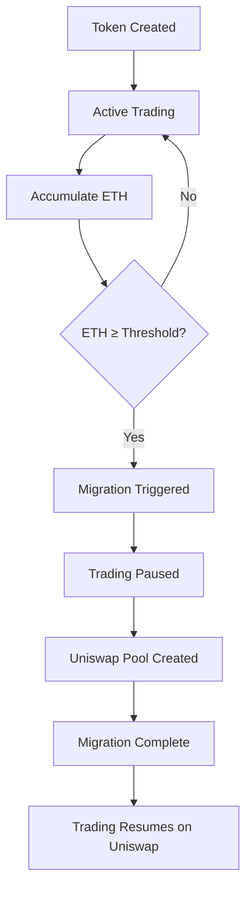

# 🚀 RAVO Documentation

<div align="center">


**Turn Your Idea Into A Global Currency**

*Revolutionary Virtual Bonding Curve System for DeFi Token Creation and Trading*

[](https://x.com/ravoecosystem)
[](https://t.me/Ravoeth)

</div>

---

## 📋 Table of Contents

- [Welcome to RAVO](#welcome-to-ravo)
- [Quick Start Guide](#quick-start-guide)
- [Core Concepts](#core-concepts)
  - [Virtual Bonding Curves](#virtual-bonding-curves)
  - [Migration System](#migration-system)
  - [Fee Distribution](#fee-distribution)
- [User Guides](#user-guides)
  - [Creating Your First Token](#creating-your-first-token)
  - [Trading on RAVO](#trading-on-ravo)
  - [Managing Your Portfolio](#managing-your-portfolio)
- [Advanced Features](#advanced-features)
  - [Analytics Dashboard](#analytics-dashboard)
  - [Automated Trading](#automated-trading)
  - [Custom Migration Thresholds](#custom-migration-thresholds)
- [Technical Documentation](#technical-documentation)
  - [Smart Contracts](#smart-contracts)
  - [API Reference](#api-reference)
  - [Integration Guide](#integration-guide)
- [Troubleshooting](#troubleshooting)
- [Frequently Asked Questions](#frequently-asked-questions)
- [Roadmap](#roadmap)
- [Community & Support](#community--support)

---

## 🎯 Welcome to RAVO

**RAVO** represents the next evolution in decentralized finance, democratizing token creation and trading through our innovative **Virtual Bonding Curve** technology. We're not just another DeFi platform—we're revolutionizing how the world thinks about token economics.

### 🌟 What Makes RAVO Different?

- **🎨 Zero Technical Barriers**: Create professional tokens without coding knowledge
- **⚡ Instant Liquidity**: Virtual bonding curves provide immediate tradability
- **🔄 Smart Migration**: Seamless transition to Uniswap when your token is ready
- **📊 Advanced Analytics**: Real-time insights and market intelligence
- **🤖 Automated Trading**: AI-powered bots for optimal trading strategies
- **💰 Fair Economics**: Transparent 3-way fee distribution system
- **🚀 50-60% Lower Gas Costs**: Optimized for efficiency and scalability

### 🎯 Our Mission

To empower creators, entrepreneurs, and communities worldwide by transforming innovative ideas into globally tradable digital currencies with institutional-grade infrastructure and user experience.

---

## 🚀 Quick Start Guide

### Prerequisites

Before you begin, ensure you have:
- **MetaMask** or compatible Web3 wallet
- **Ethereum** in your wallet (for gas fees and initial purchases)
- **Modern web browser** (Chrome, Firefox, Safari, or Edge)

### Step 1: Connect Your Wallet

1. Visit [app.ravodapp.com](https://this-is-ravo-final-website.vercel.app)
2. Click **"Connect Wallet"** in the top right corner
3. Select your preferred wallet (MetaMask recommended)
4. Approve the connection in your wallet

### Step 2: Create Your First Token

1. Click **"Create Token"** on the dashboard
2. Fill in your token details:
   - **Token Name**: Your brand/project name
   - **Token Symbol**: Short ticker (e.g., RAVO)
   - **Description**: Tell your story
   - **Migration Threshold**: ETH amount to trigger Uniswap migration
3. Set your tokenomics and branding
4. Click **"Launch Token"**

### Step 3: Start Trading

Your token is now live! Share the link with your community and start building momentum.

---

## 🧠 Core Concepts

### Virtual Bonding Curves

**Virtual Bonding Curves** are the cornerstone of RAVO's innovation. Unlike traditional AMMs that require upfront liquidity, our virtual curves provide instant liquidity through mathematical algorithms.

#### How It Works

```
Price = Initial Price × (Total Supply / Initial Supply)^Exponent
```

**Key Advantages:**
- ✅ **No Initial Liquidity Required**: Start trading immediately
- ✅ **Dynamic Pricing**: Price adjusts automatically based on supply/demand
- ✅ **Infinite Liquidity**: Mathematical guarantee of available liquidity
- ✅ **Fair Launch**: Everyone starts on equal footing

#### Curve Types

1. **Linear Curve**: Steady price increase with supply
2. **Exponential Curve**: Accelerated price growth
3. **Custom Curve**: Tailored to your project's needs

### Migration System

When your token reaches critical mass, RAVO automatically migrates it to **Uniswap V2** for maximum liquidity and exposure.

#### Migration Process



#### Migration States

- **🟢 Pre-Migration**: Active trading, accumulating funds
- **🟡 Migration in Progress**: Trading temporarily disabled
- **🔴 Migration Failed**: Automatic retry mechanism
- **✅ Migration Complete**: Successfully moved to Uniswap

### Fee Distribution

RAVO operates on a transparent **3-way fee distribution** system:

#### Fee Structure
- **1% Transaction Fee** (maximum 2%)
- **Distributed as follows:**

| Recipient | Percentage | Purpose |
|-----------|------------|---------|
| **Token Creator** | 50% | Project development and growth |
| **RAVO Team** | 25% | Platform maintenance and innovation |
| **Buyback & Partnerships** | 25% | Ecosystem expansion and token value |

#### Fee Benefits

- 💰 **Creator Rewards**: Direct incentives for successful launches
- 🔄 **Sustainable Platform**: Funds platform growth and features
- 📈 **Value Accrual**: Buyback mechanism increases token value
- 🤝 **Ecosystem Growth**: Partnership funds expand opportunities

---

## 📖 User Guides

### Creating Your First Token

#### Step-by-Step Process

1. **Access Token Creator**
   - Navigate to the dashboard
   - Click "Create New Token"

2. **Basic Information**
   ```json
   {
     "name": "Your Token Name",
     "symbol": "TKN",
     "description": "Brief project description",
     "website": "https://yourproject.com"
   }
   ```

3. **Token Configuration**
   - **Initial Supply**: Starting token amount
   - **Curve Type**: Linear, Exponential, or Custom
   - **Migration Threshold**: ETH amount for Uniswap migration
   - **Fee Settings**: Custom fee structure (optional)

4. **Branding & Media**
   - Upload logo (PNG/SVG, max 1MB)
   - Choose brand colors
   - Add social media links
   - Include project documentation

5. **Launch Settings**
   - **Private Launch**: Invite-only initial access
   - **Public Launch**: Immediate public availability
   - **Scheduled Launch**: Set specific launch time

#### Best Practices

✅ **Clear Vision**: Have a compelling project story
✅ **Community Focus**: Build engagement before launch
✅ **Real Utility**: Ensure your token has genuine value
✅ **Transparency**: Share roadmap and development plans

### Trading on RAVO

#### Basic Trading

1. **Find Tokens**
   - Browse featured tokens
   - Use search and filters
   - Check analytics and charts

2. **Execute Trade**
   - Connect wallet
   - Enter amount
   - Confirm transaction
   - Receive tokens instantly

#### Advanced Trading Features

- **📊 Limit Orders**: Set price targets
- **⏰ DCA (Dollar-Cost Averaging)**: Automated periodic purchases
- **🛡️ Stop Loss**: Automatic sell orders to limit losses
- **📈 Take Profit**: Lock in gains at target prices

### Managing Your Portfolio

#### Portfolio Dashboard

Access comprehensive portfolio analytics:
- **Token Holdings**: Real-time balances
- **Performance Charts**: Price and volume history
- **Profit/Loss Tracking**: Detailed P&L analysis
- **Portfolio Allocation**: Diversification insights

#### Portfolio Optimization

- **Rebalancing Tools**: Maintain target allocations
- **Risk Assessment**: Portfolio risk analysis
- **Yield Opportunities**: DeFi integration options
- **Tax Reporting**: Automated transaction history

---

## ⚡ Advanced Features

### Analytics Dashboard

RAVO provides institutional-grade analytics:

#### Real-Time Metrics
- **Price Action**: Live price charts and indicators
- **Volume Analysis**: Trading volume and patterns
- **Holder Distribution**: Token ownership breakdown
- **Social Sentiment**: Community engagement metrics

#### Advanced Analytics
- **On-Chain Analysis**: Transaction flow visualization
- **Market Correlation**: Compare with major cryptocurrencies
- **Liquidity Depth**: Available liquidity at different price levels
- **Trading Patterns**: Identify optimal entry/exit points

### Automated Trading

#### Trading Bot Features

- **🤖 DCA Bot**: Automated periodic investments
- **📊 Arbitrage Bot**: Exploit price differences across platforms
- **🎯 Sniping Bot**: Instant execution on new token launches
- **🔄 Rebalancing Bot**: Maintain portfolio allocations

#### Bot Configuration

```json
{
  "strategy": "DCA",
  "frequency": "daily",
  "amount": "0.1 ETH",
  "slippage": "2%",
  "gas_price": "fast"
}
```

### Custom Migration Thresholds

#### Setting Migration Parameters

- **ETH Threshold**: Minimum ETH accumulation before migration
- **Time Lock**: Minimum time before migration can trigger
- **Liquidity Requirements**: Minimum liquidity for successful migration
- **Success Criteria**: Conditions for migration completion

#### Migration Benefits

- 🎯 **Timing Control**: Choose optimal migration moment
- 💰 **Cost Optimization**: Minimize migration fees
- 📈 **Market Conditions**: Migrate during favorable conditions
- 🔒 **Security**: Multi-signature controls for large migrations

---

## 🛠️ Technical Documentation

### Smart Contracts

#### Contract Architecture

```
RAVO Core Contracts/
├── RAVOToken.sol          # ERC20 Token Implementation
├── BondingCurve.sol       # Virtual Curve Logic
├── MigrationManager.sol   # Uniswap Migration Handler
├── FeeDistributor.sol     # Fee Distribution System
└── Governance.sol         # Community Governance
```

#### Key Functions

```solidity
// Create new token with bonding curve
function createToken(
    string memory name,
    string memory symbol,
    uint256 initialSupply,
    uint256 migrationThreshold
) external returns (address)

// Execute trade on bonding curve
function trade(
    address token,
    uint256 amount,
    bool isBuy
) external payable

// Migrate to Uniswap
function migrateToUniswap(
    address token
) external
```

### API Reference

#### REST API Endpoints

```
GET  /api/v1/tokens              # List all tokens
GET  /api/v1/tokens/:id          # Get token details
POST /api/v1/tokens              # Create new token
GET  /api/v1/trades/:tokenId     # Get trade history
GET  /api/v1/analytics/:tokenId  # Get analytics data
```

#### WebSocket Streams

```javascript
// Real-time price updates
const ws = new WebSocket('wss://api.ravo.app/ws');
ws.onmessage = (event) => {
  const data = JSON.parse(event.data);
  console.log('Price Update:', data);
};
```

### Integration Guide

#### Frontend Integration

```javascript
import { RAVO } from '@ravo/sdk';

const ravo = new RAVO({
  apiKey: 'your-api-key',
  network: 'ethereum'
});

// Create token
const token = await ravo.createToken({
  name: 'My Token',
  symbol: 'MTK',
  description: 'My awesome project'
});
```

#### Backend Integration

```python
from ravo_sdk import RAVOClient

client = RAVOClient(api_key='your-api-key')

# Get token analytics
analytics = client.get_token_analytics('0x...')
print(f"Current Price: {analytics.price}")
print(f"Volume 24h: {analytics.volume_24h}")
```

---

## 🔧 Troubleshooting

### Common Issues

#### Wallet Connection Problems

**Issue**: MetaMask not connecting
**Solution**:
1. Ensure MetaMask is installed and updated
2. Check if you're on the correct network (Ethereum Mainnet)
3. Clear browser cache and reload
4. Try connecting from an incognito window

#### Transaction Failures

**Issue**: Transactions failing or stuck
**Solutions**:
- Increase gas price for faster confirmation
- Check if you have sufficient ETH for gas fees
- Verify token contract address
- Contact support with transaction hash

#### Migration Issues

**Issue**: Migration not triggering
**Solutions**:
- Verify ETH balance meets threshold
- Check migration parameters
- Ensure contract has migration permissions
- Contact technical support

### Error Codes

| Code | Description | Solution |
|------|-------------|----------|
| 1001 | Insufficient Balance | Add more ETH to wallet |
| 1002 | Network Error | Switch to stable network |
| 1003 | Contract Error | Check contract parameters |
| 1004 | Migration Failed | Retry or contact support |

---

## ❓ Frequently Asked Questions

### Getting Started

**Q: Do I need coding experience to create a token?**
A: No! RAVO's user-friendly interface makes token creation accessible to everyone, regardless of technical background.

**Q: What are the costs involved?**
A: Only Ethereum gas fees. No platform fees for basic token creation. Advanced features have optional premium pricing.

**Q: Can I create any type of token?**
A: Yes, but ensure compliance with local regulations. RAVO supports various token standards and configurations.

### Trading & Economics

**Q: How does the bonding curve work?**
A: The curve provides instant liquidity through mathematical pricing. As more people buy, the price increases automatically.

**Q: What happens during migration?**
A: Your token moves to Uniswap with preserved tokenomics. Trading continues seamlessly with increased liquidity.

**Q: Are there any risks?**
A: As with any DeFi protocol, there are smart contract and market risks. Always do your own research.

### Technical Questions

**Q: Which networks are supported?**
A: Currently Ethereum mainnet. Multi-chain support (Polygon, BSC, Arbitrum) coming in Phase 5.

**Q: Can I integrate RAVO into my project?**
A: Yes! We provide comprehensive SDKs and APIs for seamless integration.

**Q: Is the platform audited?**
A: Yes, our smart contracts undergo regular security audits by leading firms in the space.

---

## 🗺️ Roadmap

### ✅ Phase 1: Foundation (Completed)
- [x] Smart contract development and security audits
- [x] Core platform infrastructure
- [x] Community building and awareness
- [x] Beta testing with strategic partners

### 🚧 Phase 2: Launch & Growth (Current)
- [x] Public platform launch
- [ ] Advanced analytics dashboard
- [ ] Mobile application development
- [ ] Strategic partnership announcements
- [ ] Marketing campaigns and influencer collaborations

### 🔮 Phase 3: Expansion (Q1 2025)
- [ ] Telegram deployment bot
- [ ] Automated trading bots
- [ ] Cross-chain bridge implementation
- [ ] Advanced DeFi integrations
- [ ] NFT marketplace integration

### 🌟 Phase 4: Innovation (Q2 2025)
- [ ] AI-powered trading strategies
- [ ] Decentralized governance
- [ ] Multi-chain deployment
- [ ] Institutional-grade features
- [ ] Global expansion initiatives

### 🚀 Phase 5: Domination (Q3 2025)
- [ ] RAVO V3 launch with revolutionary features
- [ ] Complete multi-chain ecosystem
- [ ] Institutional partnerships
- [ ] Global regulatory compliance
- [ ] Mass adoption campaigns

---

## 🌐 Community & Support

### Connect With Us

- **📱 Telegram**: [@ravodapp](https://t.me/Ravoeth) - Community discussions and support
- **🐦 Twitter**: [@ravodapp](https://x.com/ravoecosystem) - Latest updates and announcements
- **💬 Discord**: [RAVO Community](https://discord.gg/ravo) - Technical discussions and AMA
- **📧 Email**: info@ravodapp.com - Business inquiries and partnerships
- **📚 Documentation**: [docs.ravodapp.com](https://docs.ravodapp.com) - Complete technical documentation

### Support Channels

#### Community Support
- **Telegram Group**: Instant community help
- **Discord Channels**: Specialized technical support
- **GitHub Issues**: Bug reports and feature requests

#### Professional Support
- **Priority Support**: For verified projects and partners
- **Technical Consulting**: Integration and customization services
- **Security Advisory**: Smart contract and protocol security

### Contributing

We welcome contributions from the community:

1. **Fork** the repository
2. **Create** a feature branch
3. **Commit** your changes
4. **Push** to the branch
5. **Open** a Pull Request

### Bug Bounty Program

Help us secure the platform and earn rewards:
- **Critical Vulnerabilities**: Up to $50,000
- **High Severity**: Up to $10,000
- **Medium Severity**: Up to $5,000
- **Low Severity**: Up to $1,000

---

<div align="center">

## 🎉 Ready to Launch Your Token?

**Join thousands of creators who have already transformed their ideas into global currencies.**

<div style="display: flex; gap: 20px; justify-content: center; margin: 30px 0;">

[](https://this-is-ravo-final-website.vercel.app)
[](https://this-is-ravo-final-website.vercel.app/create)
[](https://discord.gg/ravo)

</div>

---

**Built with ❤️ by the RAVO Team**

*Revolutionizing DeFi, one token at a time.*

</div>
