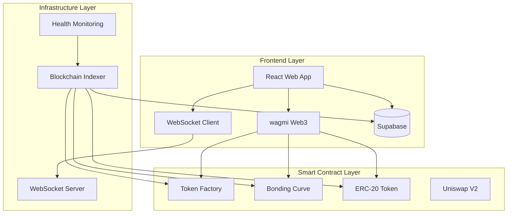

# 🚀 RAVO Protocol - Complete Technical Documentation

<div align="center">


**Revolutionary Virtual Bonding Curve System for DeFi Token Creation and Trading**

*Turn Your Idea Into A Global Currency*

[](https://docs.ravodapp.com)
[](https://x.com/ravoecosystem)
[](https://t.me/Ravoeth)

---

## 📋 Documentation Overview

This comprehensive documentation provides detailed information for developers, investors, and users of the RAVO protocol.

### 🎯 Quick Links

| **For Investors & Users** | **For Developers** | **Technical Docs** |
|---------------------------|-------------------|-------------------|
| [🚀 Getting Started](./investor/getting-started.md) | [⚡ Developer Guide](./developer/integration.md) | [🔧 Smart Contracts](./technical/contracts.md) |
| [💰 Token Economics](./investor/economics.md) | [🛠️ API Reference](./developer/api.md) | [⚙️ Architecture](./technical/architecture.md) |
| [📊 Trading Guide](./investor/trading.md) | [🔐 Security](./developer/security.md) | [📈 Analytics](./technical/analytics.md) |
| [🔄 Migration System](./investor/migration.md) | [🧪 Testing](./developer/testing.md) | [📊 Monitoring](./technical/monitoring.md) |
| [💡 Best Practices](./investor/best-practices.md) | [🚀 Deployment](./developer/deployment.md) | [🔍 Troubleshooting](./technical/troubleshooting.md) |

---

## 🌟 What Makes RAVO Revolutionary?

### ✨ **Zero Technical Barriers**
- **No Coding Required**: Create professional tokens without programming knowledge
- **User-Friendly Interface**: Responsive web application for token creation and management
- **Automated Deployment**: Smart contracts deploy automatically with optimized gas usage

### ⚡ **Instant Liquidity**
- **Virtual Bonding Curves**: Mathematical algorithms provide immediate tradability
- **Dynamic Pricing**: Price adjusts automatically based on supply/demand
- **Guaranteed Availability**: Mathematical guarantee of liquidity for trading

### 🔄 **Smart Migration System**
- **Automatic Uniswap Integration**: Seamless transition when tokens reach critical mass
- **Preserved Tokenomics**: Migration maintains original economic parameters
- **Enhanced Exposure**: Access to Uniswap's vast liquidity network

### 📊 **Real-Time Analytics**
- **Live Monitoring**: Real-time price charts and transaction tracking
- **Database Integration**: Supabase-powered analytics and data storage
- **Real-time Updates**: Live price feeds and market data via Supabase Real-time
- **Performance Metrics**: Trading volume, holder distribution, and market analysis

---

## 🏗️ Protocol Architecture



---

## 💎 Token Economics Overview

### **Virtual Bonding Curve Mechanics**

The RAVO protocol implements an innovative **Virtual Bonding Curve** system that provides:

- **Mathematical Liquidity**: `Price = InitialPrice × (Supply/InitialSupply)^Exponent`
- **Dynamic Pricing**: Automatic price adjustment based on trading activity
- **Fair Launch**: Equal opportunity for all participants
- **No Impermanent Loss**: Users never lose value due to price fluctuations

### **Fee Distribution System**

RAVO operates on a transparent **3-way fee distribution**:

| **Recipient** | **Percentage** | **Purpose** |
|---------------|----------------|-------------|
| **Token Creator** | 50% | Project development and growth |
| **RAVO Platform** | 25% | Platform maintenance and innovation |
| **Buyback & Partnerships** | 25% | Ecosystem expansion and token value |

---

## 🔒 Security & Trust

### **Multi-Layer Security Architecture**

- **Smart Contract Audits**: Regular security audits by leading firms
- **Code Obfuscation**: Protected intellectual property and algorithms
- **Access Control**: Granular permission systems
- **Emergency Controls**: Circuit breakers and pause mechanisms

### **Transparency Features**

- **On-Chain Verification**: All transactions publicly verifiable
- **Real-Time Monitoring**: 24/7 system health tracking
- **Community Governance**: Decentralized decision-making
- **Open Source Components**: Transparent codebase where appropriate

---

## 🚀 Quick Start for Developers

### **Prerequisites**

```bash
# Required tools
Node.js >= 18.0.0
npm or yarn
Git
MetaMask or compatible Web3 wallet
```

### **Installation**

```bash
# Clone the repository
git clone https://github.com/ravo-dapp/ravo-platform.git
cd ravo-platform

# Install dependencies
npm install

# Set up environment variables
cp .env.example .env.local
# Edit .env.local with your configuration

# Start development server
npm run dev
```

### **Smart Contract Interaction**

```javascript
// Connect to RAVO Token Factory
const factory = new ethers.Contract(FACTORY_ADDRESS, FACTORY_ABI, signer);

// Create a new token
const tx = await factory.createToken(
  "MyToken",      // name
  "MTK",          // symbol
  "",             // telegram
  "https://mytoken.com", // website
  "",             // twitter
  "My awesome project", // description
  parseEther("0.005"), // migration threshold
  parseEther("0.1"),   // initial buy amount
  0                    // launch timestamp
);
```

---

## 📊 Real-Time Analytics Dashboard

### **Live Metrics**

- **Price Action**: Real-time price charts with technical indicators
- **Volume Analysis**: Trading volume and pattern recognition
- **Holder Distribution**: Token ownership breakdown and analysis
- **Market Correlation**: Performance vs major cryptocurrencies

### **Advanced Analytics**

- **On-Chain Analysis**: Transaction flow visualization
- **Social Sentiment**: Community engagement metrics
- **Liquidity Depth**: Available liquidity at different price levels
- **Trading Patterns**: Optimal entry/exit point identification

---

## 🌐 Ecosystem Integration

### **Supported Networks**

- **Ethereum Mainnet**: Primary production network
- **Sepolia Testnet**: Development and testing
- **Future Networks**: Polygon, BSC, Arbitrum (Phase 5)

### **API Endpoints**

```javascript
// REST API Base URL
const API_BASE = 'https://api.ravo.app/v1';

// Available endpoints
GET  /tokens              // List all tokens
GET  /tokens/:id          // Get token details
POST /tokens              // Create new token
GET  /trades/:tokenId     // Get trade history
GET  /analytics/:tokenId  // Get analytics data
```

### **WebSocket Streams**

```javascript
// Real-time price updates
const ws = new WebSocket('wss://api.ravo.app/ws');

ws.onmessage = (event) => {
  const data = JSON.parse(event.data);
  console.log('Price Update:', data);
};
```

---

## 🤝 Community & Support

### **Connect With Us**

- **📱 Telegram**: [@ravodapp](https://t.me/Ravoeth) - Community discussions and support
- **🐦 Twitter**: [@ravodapp](https://x.com/ravoecosystem) - Latest updates and announcements
- **💬 Discord**: [RAVO Community](https://discord.gg/ravo) - Technical discussions and AMA
- **📧 Email**: info@ravodapp.com - Business inquiries and partnerships
- **📚 Documentation**: [docs.ravodapp.com](https://docs.ravodapp.com) - Complete technical documentation

### **Support Channels**

#### **Community Support**
- **Telegram Group**: Instant community help
- **Discord Channels**: Specialized technical support
- **GitHub Issues**: Bug reports and feature requests

#### **Professional Support**
- **Priority Support**: For verified projects and partners
- **Technical Consulting**: Integration and customization services
- **Security Advisory**: Smart contract and protocol security

---

## 🗺️ Roadmap & Vision

### **✅ Phase 1: Foundation (Completed)**
- [x] Smart contract development and security audits
- [x] Core platform infrastructure
- [x] Community building and awareness
- [x] Beta testing with strategic partners

### **🚧 Phase 2: Launch & Growth (Current)**
- [x] Public platform launch
- [ ] Advanced analytics dashboard
- [ ] Mobile application development
- [ ] Strategic partnership announcements
- [ ] Marketing campaigns and influencer collaborations

### **🔮 Phase 3: Expansion (Q1 2025)**
- [ ] Telegram deployment bot
- [ ] Automated trading bots
- [ ] Cross-chain bridge implementation
- [ ] Advanced DeFi integrations
- [ ] NFT marketplace integration

### **🌟 Phase 4: Innovation (Q2 2025)**
- [ ] AI-powered trading strategies
- [ ] Decentralized governance
- [ ] Multi-chain deployment
- [ ] Institutional-grade features
- [ ] Global expansion initiatives

### **🚀 Phase 5: Domination (Q3 2025)**
- [ ] RAVO V3 launch with revolutionary features
- [ ] Complete multi-chain ecosystem
- [ ] Institutional partnerships
- [ ] Global regulatory compliance
- [ ] Mass adoption campaigns

---

## ⚠️ Important Security Notice

### **Formula Protection**

**The RAVO bonding curve formula is proprietary technology protected by:**
- Code obfuscation and encryption
- Intellectual property safeguards
- Multi-layer security protocols
- Restricted access controls

**⚠️ WARNING**: Attempting to reverse-engineer or copy the bonding curve formula violates intellectual property laws and may result in legal action.

### **Security Best Practices**

1. **Never share private keys**
2. **Verify contract addresses** before interaction
3. **Use hardware wallets** for large amounts
4. **Enable 2FA** on all accounts
5. **Keep software updated** to latest versions

---

<div align="center">

## 🎉 Ready to Launch Your Token?

**Join thousands of creators who have already transformed their ideas into global currencies.**

<div style="display: flex; gap: 20px; justify-content: center; margin: 30px 0;">

[](https://this-is-ravo-final-website.vercel.app)
[](https://this-is-ravo-final-website.vercel.app/create)
[](https://discord.gg/ravo)

</div>

---

**Built with ❤️ by the RAVO Team**

*Revolutionizing DeFi, one token at a time.*

</div>
