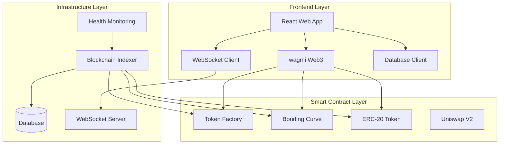

# 🚀 RAVO Protocol - Complete Technical Documentation

<div align="center">


**Revolutionary Virtual Bonding Curve System for DeFi Token Creation and Trading**

*Turn Your Idea Into A Global Currency*

[](https://docs.ravodapp.com)
[](https://x.com/ravoecosystem)
[](https://t.me/Ravoeth)

---

## 📋 Documentation Overview

This comprehensive documentation provides detailed information for developers, investors, and users of the RAVO protocol.

### 🎯 Quick Links

| **For Investors & Users** | **For Developers** | **Technical Docs** |
|---------------------------|-------------------|-------------------|
| [🚀 Getting Started](./investor/getting-started.md) | [⚡ Developer Guide](./developer/integration.md) | [🔧 Smart Contracts](./technical/contracts.md) |
| [💰 Token Economics](./investor/economics.md) | | [🔍 Troubleshooting](./technical/troubleshooting.md) |

---

## 🌟 What Makes RAVO Revolutionary?

### ✨ **Zero Technical Barriers**
- **No Coding Required**: Create professional tokens without programming knowledge
- **User-Friendly Interface**: Responsive web application for token creation and management
- **Automated Deployment**: Smart contracts deploy automatically with optimized gas usage

### ⚡ **Instant Liquidity**
- **Virtual Bonding Curves**: Mathematical algorithms provide immediate tradability
- **Dynamic Pricing**: Price adjusts automatically based on supply/demand
- **Guaranteed Availability**: Mathematical guarantee of liquidity for trading

### 🔄 **Smart Migration System**
- **Automatic Uniswap Integration**: Seamless transition when tokens reach critical mass
- **Preserved Tokenomics**: Migration maintains original economic parameters
- **Enhanced Exposure**: Access to Uniswap's vast liquidity network

### 📊 **Real-Time Analytics**
- **Database Integration**: Analytics and data storage
- **Real-time Updates**: Live price feeds and market data via WebSocket streams
- **Performance Metrics**: Trading volume, holder distribution, and market analysis

---

## 🏗️ Protocol Architecture



---

## 💎 Token Economics Overview

### **Virtual Bonding Curve Mechanics**

The RAVO protocol implements an innovative **Virtual Bonding Curve** system that provides:

- **Mathematical Liquidity**: `Price = InitialPrice × (Supply/InitialSupply)^Exponent`
- **Dynamic Pricing**: Automatic price adjustment based on trading activity
- **Fair Launch**: Equal opportunity for all participants
- **No Impermanent Loss**: Users never lose value due to price fluctuations

### **Fee Distribution System**

RAVO operates on a transparent **3-way fee distribution**:

| **Recipient** | **Percentage** | **Purpose** |
|---------------|----------------|-------------|
| **Token Creator** | 50% | Project development and growth |
| **RAVO Platform** | 25% | Platform maintenance and innovation |
| **Buyback & Partnerships** | 25% | Ecosystem expansion and token value |

### **🎯 Custom Migration Threshold - RAVO's Key Innovation**

One of RAVO's most important features is the **Custom Migration Threshold** system:

#### **What is Migration Threshold?**
- **Definition**: The amount of ETH that must accumulate in the bonding curve before automatic migration to Uniswap V2
- **Minimum Value**: 0.00019 ETH (enforced by smart contract)
- **Creator Control**: Token creators can set their own threshold above the minimum
- **Migration Trigger**: When the bonding curve reaches this threshold, it automatically migrates to Uniswap

#### **Why This Matters**
- **🎯 Strategic Control**: Creators can choose when their token graduates to Uniswap
- **📈 Market Timing**: Set thresholds based on market conditions and project goals
- **💰 Liquidity Management**: Control the amount of liquidity before Uniswap migration
- **🚀 Growth Strategy**: Lower thresholds for faster Uniswap access, higher for more bonding curve trading

#### **Migration Threshold Examples**
```javascript
// Conservative approach - more bonding curve trading
parseEther("0.01")  // 0.01 ETH threshold

// Balanced approach - moderate threshold  
parseEther("0.005") // 0.005 ETH threshold

// Aggressive approach - quick Uniswap migration
parseEther("0.001") // 0.001 ETH threshold (close to minimum)
```

#### **Migration Process**
1. **Bonding Curve Phase**: Token trades on virtual bonding curve
2. **Threshold Reached**: ETH balance reaches custom migration threshold
3. **Automatic Migration**: Smart contract migrates to Uniswap V2
4. **Liquidity Provision**: All ETH and tokens become Uniswap liquidity
5. **Uniswap Trading**: Token now trades on Uniswap with full DEX exposure

### **🚀 Custom Launch Time Feature**

Token creators can set a custom launch time for their tokens, providing strategic control over when trading begins.

#### **Launch Time Options**
- **Immediate Launch**: Set `launchTimestamp` to `0` for instant trading
- **Scheduled Launch**: Set future timestamp for delayed trading activation
- **Owner Override**: Token owner can open trading early if needed

#### **Launch Time Examples**
```javascript
// Immediate launch (trading starts right away)
const immediateLaunch = 0;

// Launch in 24 hours
const launchIn24h = Math.floor(Date.now() / 1000) + (24 * 60 * 60);

// Launch on specific date (e.g., January 1, 2025)
const specificDate = new Date('2025-01-01T00:00:00Z').getTime() / 1000;

// Create token with custom launch time
const tx = await factory.createToken(
  "MyToken",
  "MTK",
  "https://t.me/mytoken",
  "https://mytoken.com",
  "https://x.com/mytoken",
  "My awesome project",
  parseEther("0.005"), // migration threshold
  parseEther("0.1"),   // initial buy amount
  launchIn24h          // custom launch time
);
```

#### **Launch Time Benefits**
- **🎯 Strategic Timing**: Launch during optimal market conditions
- **📢 Marketing Preparation**: Time to build community before trading
- **⏰ Coordinated Launch**: Synchronize with marketing campaigns
- **🔄 Flexibility**: Owner can open trading early if needed

---

## 🔒 Security & Trust

### **Multi-Layer Security Architecture**

- **Smart Contract Audits**: Regular security audits by leading firms
- **Code Security**: Advanced security protocols and encryption
- **Access Control**: Granular permission systems

### **Transparency Features**

- **On-Chain Verification**: All transactions publicly verifiable
- **Real-Time Monitoring**: 24/7 system health tracking
- **Community Governance**: Decentralized decision-making
- **Open Source Components**: Transparent codebase where appropriate

---

## 🚀 Creating Tokens with RAVO

### **Smart Contract Integration**

```javascript
// Connect to RAVO Token Factory
const factory = new ethers.Contract(FACTORY_ADDRESS, FACTORY_ABI, signer);

// Create a new token with custom migration threshold
const tx = await factory.createToken(
  "MyToken",                    // name
  "MTK",                        // symbol
  "https://t.me/mytoken",       // telegram
  "https://mytoken.com",        // website
  "https://x.com/mytoken",      // twitter
  "My awesome project",         // description
  parseEther("0.005"),         // migration threshold (custom!)
  parseEther("0.1"),           // initial buy amount
  0                            // launch timestamp (0 = immediate)
);

// Wait for transaction confirmation
const receipt = await tx.wait();

// Parse TokenCreated event to get addresses
const tokenCreatedEvent = receipt.events.find(
  event => event.event === 'TokenCreated'
);

if (tokenCreatedEvent) {
  const { token, bondingCurve, creator } = tokenCreatedEvent.args;
  console.log('Token created:', {
    tokenAddress: token,
    bondingCurveAddress: bondingCurve,
    creator: creator
  });
}
```

---

## 📊 Real-Time Analytics Dashboard

### **Live Metrics**

- **Price Action**: Real-time price charts with technical indicators
- **Volume Analysis**: Trading volume and pattern recognition
- **Holder Distribution**: Token ownership breakdown and analysis
- **Market Correlation**: Performance vs major cryptocurrencies

### **Advanced Analytics**

- **On-Chain Analysis**: Transaction flow visualization
- **Social Sentiment**: Community engagement metrics
- **Liquidity Depth**: Available liquidity at different price levels
- **Trading Patterns**: Optimal entry/exit point identification

---

## 🌐 Ecosystem Integration

### **Supported Networks**

- **Ethereum Mainnet**: Primary production network
- **Sepolia Testnet**: Development and testing
- **Future Networks**: Polygon, BSC, Arbitrum (Phase 5)

### **API Endpoints**

```javascript
// REST API Base URL
const API_BASE = 'https://api.ravo.app/v1';

// Available endpoints
GET  /tokens              // List all tokens
GET  /tokens/:id          // Get token details
POST /tokens              // Create new token
GET  /trades/:tokenId     // Get trade history
GET  /analytics/:tokenId  // Get analytics data
```

### **WebSocket Streams**

```javascript
// Real-time price updates
const ws = new WebSocket('wss://api.ravo.app/ws');

ws.onmessage = (event) => {
  const data = JSON.parse(event.data);
  console.log('Price Update:', data);
};
```

---

## 🤝 Community & Support

### **Connect With Us**

- **📱 Telegram**: [@ravodapp](https://t.me/Ravoeth) - Community discussions and support
- **🐦 Twitter**: [@ravodapp](https://x.com/ravoecosystem) - Latest updates and announcements
- **💬 Telegram**: [RAVO Community](https://t.me/Ravoeth) - Community discussions and updates
- **📧 Email**: info@ravodapp.com - Business inquiries and partnerships
- **📚 Documentation**: [docs.ravodapp.com](https://docs.ravodapp.com) - Complete technical documentation

### **Support Channels**

#### **Community Support**
- **Telegram Group**: Instant community help
- **X (Twitter)**: [RAVO Ecosystem](https://x.com/ravoecosystem) - Latest updates and announcements
- **GitHub Issues**: Bug reports and feature requests

#### **Professional Support**
- **Priority Support**: For verified projects and partners
- **Technical Consulting**: Integration and customization services
- **Security Advisory**: Smart contract and protocol security

---

## 🗺️ Roadmap & Vision

### **✅ Phase 1: Foundation (Completed)**
- [x] Smart contract development and security audits
- [x] Core platform infrastructure
- [x] Community building and awareness
- [x] Beta testing with strategic partners

### **🚧 Phase 2: Launch & Growth (Current)**
- [x] Public platform launch
- [ ] Advanced analytics dashboard
- [ ] Mobile application development
- [ ] Strategic partnership announcements
- [ ] Marketing campaigns and influencer collaborations

### **🔮 Phase 3: Expansion (Q1 2025)**
- [ ] Telegram deployment bot
- [ ] Automated trading bots
- [ ] Cross-chain bridge implementation
- [ ] Advanced DeFi integrations

### **🌟 Phase 4: Innovation (Q2 2026)**
- [ ] AI-powered trading strategies
- [ ] Decentralized governance
- [ ] Multi-chain deployment
- [ ] Institutional-grade features
- [ ] Global expansion initiatives

### **🚀 Phase 5: Domination (Q3 2026)**
- [ ] RAVO V3 launch with revolutionary features
- [ ] Complete multi-chain ecosystem
- [ ] Institutional partnerships
- [ ] Global regulatory compliance
- [ ] Mass adoption campaigns

---

<div align="center">

## 🎉 Ready to Launch Your Token?

**Join thousands of creators who have already transformed their ideas into global currencies.**

<div style="display: flex; gap: 20px; justify-content: center; margin: 30px 0;">

[](https://this-is-ravo-final-website.vercel.app)
[](https://this-is-ravo-final-website.vercel.app/create-token)
[](https://t.me/Ravoeth)

</div>

---

**Built with ❤️ by the RAVO Team**

*Revolutionizing DeFi, one token at a time.*

</div>
