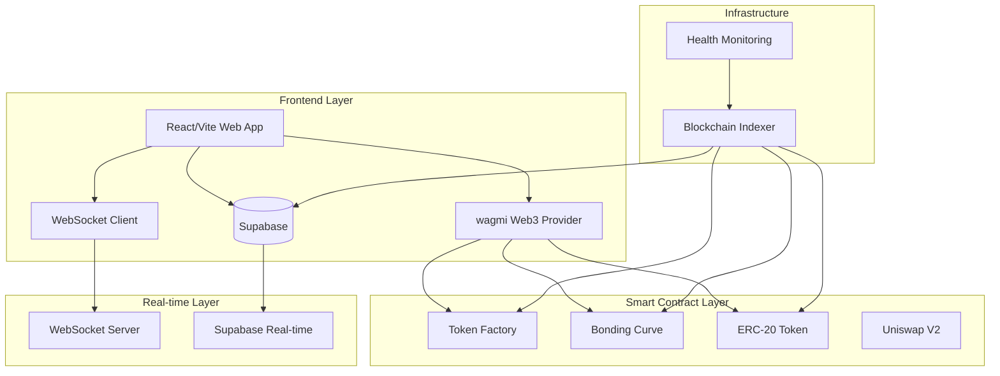

# 🛠️ Developer Integration Guide

<div align="center">


**Complete Technical Integration Guide for RAVO Protocol**

*Build powerful DeFi applications with RAVO's Virtual Bonding Curve technology*

</div>

---

## 📋 Table of Contents

- [Prerequisites](#prerequisites)
- [Architecture Overview](#architecture-overview)
- [Smart Contract Integration](#smart-contract-integration)
- [API Integration](#api-integration)
- [WebSocket Streams](#websocket-streams)
- [Security Best Practices](#security-best-practices)
- [Testing & Deployment](#testing--deployment)
- [Formula Protection](#formula-protection)

---

## 🔧 Prerequisites

### **System Requirements**

```bash
# Required tools
Node.js >= 18.0.0
npm
Git
MetaMask, Coinbase Wallet, or compatible Web3 wallet
```

### **Technology Stack Overview**

| **Layer** | **Technology** | **Purpose** |
|-----------|----------------|-------------|
| **Frontend** | React 18 + TypeScript + Vite | User interface and interactions |
| **Styling** | Tailwind CSS + shadcn/ui | Responsive design and components |
| **Web3** | wagmi + viem + Reown | Blockchain connectivity |
| **Database** | Supabase (PostgreSQL) | Data storage and real-time updates |
| **Real-time** | WebSocket + Supabase Real-time | Live price feeds and notifications |
| **Charts** | TradingVue.js + Lightweight Charts | Trading interface and analytics |
| **State Management** | React Context + Supabase | Application state |

### **Network Requirements**

- **Mainnet**: Ethereum mainnet for production
- **Testnet**: Sepolia testnet for development
- **RPC Providers**: Multiple providers for redundancy
- **WebSocket**: Real-time data streaming

---

## 🏗️ Architecture Overview

### **System Architecture**



### **Core Components**

#### **Token Factory Contract**
- **Address**: `0xa6b924e602eB9E8f6715439fd8C0111A3b4155C2` (Sepolia)
- **Purpose**: Creates new tokens and bonding curves
- **Gas Optimized**: Minimal deployment costs

#### **Bonding Curve Contract**
- **Dynamic Deployment**: New instance per token
- **Formula Protection**: Proprietary algorithm with IP safeguards
- **Auto-Migration**: Seamless Uniswap integration

#### **ERC-20 Token Contract**
- **Standard Compliance**: Full ERC-20 implementation
- **Enhanced Features**: Social links, descriptions, trading controls
- **Owner Management**: Transferable ownership with renounce capability

---

## 🔧 Smart Contract Integration

### **Contract Addresses**

```javascript
// Sepolia Testnet Addresses (Current)
const CONTRACTS = {
  FACTORY: '0x1F2219162955396B9d5140d71d2C8832F5471253',
  UNISWAP_ROUTER: '0xeE567Fe1712Faf6149d80dA1E6934E354124CfE3',
  UNISWAP_FACTORY: '0xF62c03E08ada871A0bEb309762E260a7a6a88075',
  WETH: '0x7b79995e5f793A07Bc00c21412e50Ecae098E7f9'
};

// Mainnet Addresses (Future deployment)
const MAINNET_CONTRACTS = {
  FACTORY: '0x...', // To be deployed
  // ... other addresses
};
```

### **Creating Tokens Programmatically**

```javascript
import { ethers } from 'ethers';

const FACTORY_ABI = [
  {
    "inputs": [
      {"internalType": "string", "name": "name", "type": "string"},
      {"internalType": "string", "name": "symbol", "type": "string"},
      {"internalType": "string", "name": "telegram", "type": "string"},
      {"internalType": "string", "name": "website", "type": "string"},
      {"internalType": "string", "name": "xProfile", "type": "string"},
      {"internalType": "string", "name": "description", "type": "string"},
      {"internalType": "uint256", "name": "migrationThreshold", "type": "uint256"},
      {"internalType": "uint256", "name": "initialBuyAmount", "type": "uint256"},
      {"internalType": "uint256", "name": "launchTimestamp", "type": "uint256"}
    ],
    "name": "createToken",
    "outputs": [],
    "stateMutability": "payable",
    "type": "function"
  },
  {
    "anonymous": false,
    "inputs": [
      {"indexed": true, "internalType": "address", "name": "token", "type": "address"},
      {"indexed": true, "internalType": "address", "name": "bondingCurve", "type": "address"},
      {"indexed": true, "internalType": "address", "name": "creator", "type": "address"},
      {"indexed": false, "internalType": "uint256", "name": "launchTimestamp", "type": "uint256"}
    ],
    "name": "TokenCreated",
    "type": "event"
  }
];

async function createToken() {
  const provider = new ethers.providers.Web3Provider(window.ethereum);
  const signer = provider.getSigner();

  const factory = new ethers.Contract(
    CONTRACTS.FACTORY,
    FACTORY_ABI,
    signer
  );

  // Calculate total value (creation fee + initial buy)
  const creationFee = ethers.utils.parseEther('0.0001'); // From environment
  const initialBuyAmount = ethers.utils.parseEther('0.1');
  const totalValue = creationFee.add(initialBuyAmount);

  // Create token
  const tx = await factory.createToken(
    'My Awesome Token',        // name
    'MAT',                     // symbol
    'https://t.me/mytoken',    // telegram
    'https://mytoken.com',     // website
    'https://x.com/mytoken',   // twitter
    'Revolutionary DeFi project', // description
    ethers.utils.parseEther('0.005'), // migration threshold
    initialBuyAmount,          // initial buy amount
    0,                         // launch timestamp (0 = immediate)
    { value: totalValue }
  );

  // Wait for transaction
  const receipt = await tx.wait();

  // Parse TokenCreated event
  const tokenCreatedEvent = receipt.events.find(
    event => event.event === 'TokenCreated'
  );

  if (tokenCreatedEvent) {
    const { token, bondingCurve, creator } = tokenCreatedEvent.args;
    console.log('Token created:', {
      tokenAddress: token,
      bondingCurveAddress: bondingCurve,
      creator: creator
    });
  }

  return receipt;
}
```

### **Trading Functions**

```javascript
const BONDING_CURVE_ABI = [
  // Buy tokens
  {
    "inputs": [
      {"internalType": "uint256", "name": "slippagePercent", "type": "uint256"}
    ],
    "name": "buyTokens",
    "outputs": [{"internalType": "uint256", "name": "", "type": "uint256"}],
    "stateMutability": "payable",
    "type": "function"
  },

  // Sell tokens
  {
    "inputs": [
      {"internalType": "uint256", "name": "tokenAmount", "type": "uint256"},
      {"internalType": "uint256", "name": "slippagePercent", "type": "uint256"}
    ],
    "name": "sellTokens",
    "outputs": [],
    "stateMutability": "nonpayable",
    "type": "function"
  },

  // Estimate functions
  {
    "inputs": [{"internalType": "uint256", "name": "ethAmount", "type": "uint256"}],
    "name": "estimateBuyTokens",
    "outputs": [{"internalType": "uint256", "name": "", "type": "uint256"}],
    "stateMutability": "view",
    "type": "function"
  },

  {
    "inputs": [{"internalType": "uint256", "name": "tokenAmount", "type": "uint256"}],
    "name": "estimateSellETH",
    "outputs": [{"internalType": "uint256", "name": "", "type": "uint256"}],
    "stateMutability": "view",
    "type": "function"
  },

  // Migration status
  {
    "inputs": [],
    "name": "getMigrationStatus",
    "outputs": [
      {"internalType": "bool", "name": "_migrated", "type": "bool"},
      {"internalType": "bool", "name": "_isMigrating", "type": "bool"},
      {"internalType": "bool", "name": "_canRetry", "type": "bool"}
    ],
    "stateMutability": "view",
    "type": "function"
  }
];

async function buyTokens(bondingCurveAddress, ethAmount, slippagePercent = 2) {
  const provider = new ethers.providers.Web3Provider(window.ethereum);
  const signer = provider.getSigner();

  const bondingCurve = new ethers.Contract(
    bondingCurveAddress,
    BONDING_CURVE_ABI,
    signer
  );

  // Estimate tokens to receive
  const estimatedTokens = await bondingCurve.estimateBuyTokens(
    ethers.utils.parseEther(ethAmount.toString())
  );

  console.log(`Estimated tokens: ${ethers.utils.formatEther(estimatedTokens)}`);

  // Execute buy with slippage protection
  const tx = await bondingCurve.buyTokens(slippagePercent, {
    value: ethers.utils.parseEther(ethAmount.toString())
  });

  const receipt = await tx.wait();
  console.log('Buy transaction confirmed:', receipt.transactionHash);

  return receipt;
}

async function sellTokens(bondingCurveAddress, tokenAmount, slippagePercent = 2) {
  const provider = new ethers.providers.Web3Provider(window.ethereum);
  const signer = provider.getSigner();

  const bondingCurve = new ethers.Contract(
    bondingCurveAddress,
    BONDING_CURVE_ABI,
    signer
  );

  // First approve tokens for spending
  const tokenAddress = await bondingCurve.token();
  const token = new ethers.Contract(tokenAddress, ERC20_ABI, signer);

  await token.approve(bondingCurveAddress, ethers.utils.parseEther(tokenAmount.toString()));

  // Estimate ETH to receive
  const estimatedETH = await bondingCurve.estimateSellETH(
    ethers.utils.parseEther(tokenAmount.toString())
  );

  console.log(`Estimated ETH: ${ethers.utils.formatEther(estimatedETH)}`);

  // Execute sell
  const tx = await bondingCurve.sellTokens(
    ethers.utils.parseEther(tokenAmount.toString()),
    slippagePercent
  );

  const receipt = await tx.wait();
  console.log('Sell transaction confirmed:', receipt.transactionHash);

  return receipt;
}
```

### **Token Management**

```javascript
const TOKEN_ABI = [
  // Read functions
  {
    "inputs": [],
    "name": "name",
    "outputs": [{"internalType": "string", "name": "", "type": "string"}],
    "stateMutability": "view",
    "type": "function"
  },

  {
    "inputs": [],
    "name": "symbol",
    "outputs": [{"internalType": "string", "name": "", "type": "string"}],
    "stateMutability": "view",
    "type": "function"
  },

  {
    "inputs": [],
    "name": "totalSupply",
    "outputs": [{"internalType": "uint256", "name": "", "type": "uint256"}],
    "stateMutability": "view",
    "type": "function"
  },

  {
    "inputs": [{"internalType": "address", "name": "account", "type": "address"}],
    "name": "balanceOf",
    "outputs": [{"internalType": "uint256", "name": "", "type": "uint256"}],
    "stateMutability": "view",
    "type": "function"
  },

  // Owner functions
  {
    "inputs": [{"internalType": "string", "name": "_description", "type": "string"}],
    "name": "setDescription",
    "outputs": [],
    "stateMutability": "nonpayable",
    "type": "function"
  },

  {
    "inputs": [
      {"internalType": "string", "name": "_telegram", "type": "string"},
      {"internalType": "string", "name": "_website", "type": "string"},
      {"internalType": "string", "name": "_xProfile", "type": "string"}
    ],
    "name": "setSocialLinks",
    "outputs": [],
    "stateMutability": "nonpayable",
    "type": "function"
  },

  {
    "inputs": [],
    "name": "openTradingNow",
    "outputs": [],
    "stateMutability": "nonpayable",
    "type": "function"
  }
];

async function updateTokenMetadata(tokenAddress) {
  const provider = new ethers.providers.Web3Provider(window.ethereum);
  const signer = provider.getSigner();

  const token = new ethers.Contract(tokenAddress, TOKEN_ABI, signer);

  // Update description
  await token.setDescription('Updated project description with new features');

  // Update social links
  await token.setSocialLinks(
    'https://t.me/updatedchannel',
    'https://updatedwebsite.com',
    'https://x.com/updatedhandle'
  );

  console.log('Token metadata updated successfully');
}
```

---

## 🔗 Database Integration

### **Supabase Integration**

RAVO uses Supabase (PostgreSQL) for data storage and real-time updates. The platform provides direct database access through Supabase client.

```javascript
import { createClient } from '@supabase/supabase-js';

const supabaseUrl = process.env.NEXT_PUBLIC_SUPABASE_URL;
const supabaseKey = process.env.NEXT_PUBLIC_SUPABASE_ANON_KEY;

const supabase = createClient(supabaseUrl, supabaseKey);

// Get token list with real-time updates
async function getTokens(options = {}) {
  const {
    page = 1,
    limit = 50,
    sortBy = 'created_at',
    sortOrder = 'desc'
  } = options;

  const from = (page - 1) * limit;
  const to = from + limit - 1;

  const { data, error, count } = await supabase
    .from('tokens')
    .select('*', { count: 'exact' })
    .range(from, to)
    .order(sortBy, { ascending: sortOrder === 'asc' });

  if (error) throw error;

  return {
    tokens: data,
    totalCount: count,
    currentPage: page,
    totalPages: Math.ceil(count / limit)
  };
}

// Get specific token with relationships
async function getToken(tokenAddress) {
  const { data, error } = await supabase
    .from('tokens')
    .select(`
      *,
      transactions (*),
      token_stats (*)
    `)
    .eq('address', tokenAddress)
    .single();

  if (error) throw error;

  return data;
}

// Subscribe to real-time token updates
function subscribeToTokenUpdates(tokenAddress, callback) {
  const subscription = supabase
    .channel(`token_${tokenAddress}`)
    .on(
      'postgres_changes',
      {
        event: '*',
        schema: 'public',
        table: 'transactions',
        filter: `token_address=eq.${tokenAddress}`
      },
      (payload) => {
        callback(payload);
      }
    )
    .subscribe();

  return subscription;
}

// Get trade history with pagination
async function getTradeHistory(tokenAddress, options = {}) {
  const {
    page = 1,
    limit = 100,
    sortBy = 'timestamp',
    sortOrder = 'desc'
  } = options;

  const from = (page - 1) * limit;
  const to = from + limit - 1;

  const { data, error } = await supabase
    .from('transactions')
    .select('*')
    .eq('token_address', tokenAddress)
    .range(from, to)
    .order(sortBy, { ascending: sortOrder === 'asc' });

  if (error) throw error;

  return data;
}

### **Advanced Supabase Usage**

```javascript
class RAVODataClient {
  constructor() {
    this.supabase = createClient(
      process.env.NEXT_PUBLIC_SUPABASE_URL,
      process.env.NEXT_PUBLIC_SUPABASE_ANON_KEY
    );
  }

  // Advanced token queries with filters
  async getFilteredTokens(filters = {}) {
    let query = this.supabase.from('tokens').select('*');

    // Apply filters
    if (filters.symbol) {
      query = query.ilike('symbol', `%${filters.symbol}%`);
    }

    if (filters.creator) {
      query = query.eq('creator_address', filters.creator);
    }

    if (filters.migrationStatus) {
      query = query.eq('migration_status', filters.migrationStatus);
    }

    if (filters.priceRange) {
      const { min, max } = filters.priceRange;
      query = query.gte('current_price', min).lte('current_price', max);
    }

    if (filters.sortBy) {
      const ascending = filters.sortOrder === 'asc';
      query = query.order(filters.sortBy, { ascending });
    }

    const { data, error } = await query;
    if (error) throw error;

    return data;
  }

  // Real-time analytics subscription
  subscribeToAnalytics(tokenAddress, callback) {
    const subscription = this.supabase
      .channel(`analytics_${tokenAddress}`)
      .on(
        'postgres_changes',
        {
          event: '*',
          schema: 'public',
          table: 'token_stats',
          filter: `token_address=eq.${tokenAddress}`
        },
        (payload) => {
          callback(payload.new);
        }
      )
      .subscribe();

    return subscription;
  }

  // Batch operations for performance
  async batchUpdateTokenStats(updates) {
    const { data, error } = await this.supabase
      .from('token_stats')
      .upsert(updates, {
        onConflict: 'token_address',
        ignoreDuplicates: false
      });

    if (error) throw error;
    return data;
  }

  // Complex analytics queries
  async getTokenAnalytics(tokenAddress, timeframe = '24h') {
    const startTime = new Date();
    startTime.setHours(startTime.getHours() - parseInt(timeframe));

    const { data, error } = await this.supabase
      .from('transactions')
      .select(`
        amount,
        price,
        transaction_type,
        timestamp,
        buyer_address,
        seller_address
      `)
      .eq('token_address', tokenAddress)
      .gte('timestamp', startTime.toISOString())
      .order('timestamp', { ascending: false });

    if (error) throw error;

    // Calculate analytics
    const analytics = {
      volume24h: data.reduce((sum, tx) => sum + parseFloat(tx.amount), 0),
      transactions24h: data.length,
      uniqueTraders: new Set([
        ...data.map(tx => tx.buyer_address),
        ...data.map(tx => tx.seller_address)
      ]).size,
      priceChange24h: this.calculatePriceChange(data),
      topHolders: this.calculateTopHolders(data)
    };

    return analytics;
  }

  calculatePriceChange(transactions) {
    if (transactions.length < 2) return 0;

    const sortedTx = transactions.sort((a, b) =>
      new Date(a.timestamp) - new Date(b.timestamp)
    );

    const firstPrice = sortedTx[0].price;
    const lastPrice = sortedTx[sortedTx.length - 1].price;

    return ((lastPrice - firstPrice) / firstPrice) * 100;
  }

  calculateTopHolders(transactions) {
    const holderBalances = {};

    transactions.forEach(tx => {
      if (tx.buyer_address) {
        holderBalances[tx.buyer_address] =
          (holderBalances[tx.buyer_address] || 0) + parseFloat(tx.amount);
      }
      if (tx.seller_address) {
        holderBalances[tx.seller_address] =
          (holderBalances[tx.seller_address] || 0) - parseFloat(tx.amount);
      }
    });

    return Object.entries(holderBalances)
      .sort(([,a], [,b]) => b - a)
      .slice(0, 10)
      .map(([address, balance]) => ({ address, balance }));
  }
}

// Usage example
const ravoClient = new RAVODataClient();

try {
  // Get filtered tokens
  const filteredTokens = await ravoClient.getFilteredTokens({
    migrationStatus: 'Live',
    sortBy: 'created_at',
    sortOrder: 'desc'
  });

  // Subscribe to analytics
  const unsubscribe = ravoClient.subscribeToAnalytics(
    '0x123...',
    (analytics) => {
      console.log('Real-time analytics:', analytics);
    }
  );

  // Get complex analytics
  const analytics = await ravoClient.getTokenAnalytics('0x123...', '7d');
  console.log('7-day Analytics:', analytics);

} catch (error) {
  console.error('Database Error:', error.message);
}
```

---

## 🌐 Real-Time Data Integration

### **Supabase Real-Time Subscriptions**

```javascript
import { createClient } from '@supabase/supabase-js';
import { RealtimeChannel } from '@supabase/supabase-js';

class RAVORealtimeClient {
  constructor() {
    this.supabase = createClient(
      process.env.NEXT_PUBLIC_SUPABASE_URL,
      process.env.NEXT_PUBLIC_SUPABASE_ANON_KEY
    );
    this.subscriptions = new Map();
  }

  // Subscribe to token price updates
  subscribeToTokenPrices(tokenAddress, callback) {
    const channelName = `token_price_${tokenAddress}`;

    const channel = this.supabase
      .channel(channelName)
      .on(
        'postgres_changes',
        {
          event: 'UPDATE',
          schema: 'public',
          table: 'token_stats',
          filter: `token_address=eq.${tokenAddress}`
        },
        (payload) => {
          callback({
            type: 'price_update',
            tokenAddress,
            newPrice: payload.new.current_price,
            priceChange: payload.new.price_change_24h,
            volume24h: payload.new.volume_24h,
            timestamp: new Date().toISOString()
          });
        }
      )
      .subscribe();

    this.subscriptions.set(channelName, channel);
    return channelName;
  }

  // Subscribe to new transactions
  subscribeToTransactions(tokenAddress, callback) {
    const channelName = `transactions_${tokenAddress}`;

    const channel = this.supabase
      .channel(channelName)
      .on(
        'postgres_changes',
        {
          event: 'INSERT',
          schema: 'public',
          table: 'transactions',
          filter: `token_address=eq.${tokenAddress}`
        },
        (payload) => {
          callback({
            type: 'new_transaction',
            transaction: payload.new,
            tokenAddress,
            timestamp: new Date().toISOString()
          });
        }
      )
      .subscribe();

    this.subscriptions.set(channelName, channel);
    return channelName;
  }

  // Subscribe to migration events
  subscribeToMigrations(callback) {
    const channelName = 'migrations';

    const channel = this.supabase
      .channel(channelName)
      .on(
        'postgres_changes',
        {
          event: 'UPDATE',
          schema: 'public',
          table: 'tokens',
          filter: 'migration_status=eq.Migrating'
        },
        (payload) => {
          callback({
            type: 'migration_started',
            tokenAddress: payload.new.address,
            migrationStatus: payload.new.migration_status,
            timestamp: new Date().toISOString()
          });
        }
      )
      .on(
        'postgres_changes',
        {
          event: 'UPDATE',
          schema: 'public',
          table: 'tokens',
          filter: 'migration_status=eq.Migrated'
        },
        (payload) => {
          callback({
            type: 'migration_completed',
            tokenAddress: payload.new.address,
            uniswapPair: payload.new.uniswap_pair_address,
            timestamp: new Date().toISOString()
          });
        }
      )
      .subscribe();

    this.subscriptions.set(channelName, channel);
    return channelName;
  }

  // Unsubscribe from specific channel
  unsubscribe(channelName) {
    const channel = this.subscriptions.get(channelName);
    if (channel) {
      this.supabase.removeChannel(channel);
      this.subscriptions.delete(channelName);
    }
  }

  // Unsubscribe from all channels
  unsubscribeAll() {
    for (const [channelName, channel] of this.subscriptions) {
      this.supabase.removeChannel(channel);
    }
    this.subscriptions.clear();
  }
}

// Usage example
const realtimeClient = new RAVORealtimeClient();

// Subscribe to multiple data streams
const priceSubscription = realtimeClient.subscribeToTokenPrices(
  '0x1F2219162955396B9d5140d71d2C8832F5471253',
  (update) => {
    console.log('Price update:', update);
    // Update price display
    updatePriceDisplay(update.newPrice);
  }
);

const transactionSubscription = realtimeClient.subscribeToTransactions(
  '0x1F2219162955396B9d5140d71d2C8832F5471253',
  (transaction) => {
    console.log('New transaction:', transaction);
    // Add to transaction list
    addTransactionToList(transaction.transaction);
  }
);

const migrationSubscription = realtimeClient.subscribeToMigrations(
  (migration) => {
    console.log('Migration event:', migration);
    // Update migration status
    updateMigrationStatus(migration);
  }
);

// Cleanup when component unmounts
function cleanup() {
  realtimeClient.unsubscribeAll();
}
```

---

## 🔒 Security Best Practices

### **Smart Contract Security**

```javascript
// Security checklist for integration

const SECURITY_CHECKS = {
  // 1. Address Validation
  validateAddress: (address) => {
    return ethers.utils.isAddress(address);
  },

  // 2. Amount Validation
  validateAmount: (amount, minAmount = 0, maxAmount = ethers.constants.MaxUint256) => {
    const amountBN = ethers.BigNumber.from(amount);
    return amountBN.gte(minAmount) && amountBN.lte(maxAmount);
  },

  // 3. Slippage Protection
  calculateSlippage: (expectedAmount, actualAmount, tolerance = 2) => {
    const difference = expectedAmount.sub(actualAmount).abs();
    const slippage = difference.mul(100).div(expectedAmount);
    return slippage.lte(tolerance);
  },

  // 4. Gas Estimation
  estimateGas: async (contract, method, params) => {
    try {
      const gasEstimate = await contract.estimateGas[method](...params);
      // Add 20% buffer for gas price fluctuations
      return gasEstimate.mul(120).div(100);
    } catch (error) {
      console.error('Gas estimation failed:', error);
      throw error;
    }
  },

  // 5. Transaction Simulation
  simulateTransaction: async (contract, method, params, value = 0) => {
    try {
      await contract.callStatic[method](...params, { value });
      return true;
    } catch (error) {
      console.error('Transaction simulation failed:', error);
      return false;
    }
  }
};

// Secure transaction execution
async function executeSecureTransaction(contract, method, params, options = {}) {
  const {
    slippageTolerance = 2,
    gasBuffer = 20,
    simulate = true
  } = options;

  try {
    // Validate inputs
    if (params.length > 0) {
      // Add your validation logic here
    }

    // Simulate transaction
    if (simulate) {
      const simulationSuccess = await SECURITY_CHECKS.simulateTransaction(
        contract,
        method,
        params,
        options.value
      );

      if (!simulationSuccess) {
        throw new Error('Transaction simulation failed');
      }
    }

    // Estimate gas
    const gasLimit = await SECURITY_CHECKS.estimateGas(
      contract,
      method,
      params
    );

    // Execute transaction
    const tx = await contract[method](...params, {
      ...options,
      gasLimit
    });

    console.log('Transaction sent:', tx.hash);

    // Wait for confirmation
    const receipt = await tx.wait();

    if (receipt.status === 1) {
      console.log('Transaction confirmed');
      return receipt;
    } else {
      throw new Error('Transaction failed');
    }

  } catch (error) {
    console.error('Secure transaction failed:', error);
    throw error;
  }
}
```

### **API Security**

```javascript
// API Security Headers
const API_HEADERS = {
  'Content-Type': 'application/json',
  'X-API-Key': process.env.REACT_APP_RAVO_API_KEY,
  'X-Request-ID': generateRequestId(),
  'User-Agent': 'RAVO-SDK/1.0.0'
};

// Request signing for enhanced security
function signRequest(payload, secret) {
  const message = JSON.stringify(payload);
  return crypto.createHmac('sha256', secret).update(message).digest('hex');
}

// Rate limiting
class RateLimiter {
  constructor(maxRequests = 100, windowMs = 60000) {
    this.maxRequests = maxRequests;
    this.windowMs = windowMs;
    this.requests = [];
  }

  canMakeRequest() {
    const now = Date.now();
    this.requests = this.requests.filter(time => now - time < this.windowMs);

    if (this.requests.length >= this.maxRequests) {
      return false;
    }

    this.requests.push(now);
    return true;
  }
}

const rateLimiter = new RateLimiter();

// Secure API call
async function secureApiCall(endpoint, data, method = 'POST') {
  if (!rateLimiter.canMakeRequest()) {
    throw new Error('Rate limit exceeded');
  }

  const payload = {
    ...data,
    timestamp: Date.now(),
    nonce: generateNonce()
  };

  const signature = signRequest(payload, process.env.REACT_APP_API_SECRET);

  const response = await fetch(endpoint, {
    method,
    headers: {
      ...API_HEADERS,
      'X-Signature': signature
    },
    body: JSON.stringify(payload)
  });

  if (!response.ok) {
    throw new Error(`API call failed: ${response.status}`);
  }

  return response.json();
}
```

---

## 🧪 Testing & Deployment

### **Testing Framework**

```javascript
// test/TokenFactory.test.js
const { expect } = require('chai');
const { ethers } = require('hardhat');

describe('TokenFactory', function () {
  let factory;
  let owner;
  let user;
  let tokenLogic;
  let bondingCurveLogic;

  beforeEach(async function () {
    [owner, user] = await ethers.getSigners();

    // Deploy logic contracts
    const Token = await ethers.getContractFactory('Token');
    tokenLogic = await Token.deploy();

    const BondingCurve = await ethers.getContractFactory('RavoBondingCurve');
    bondingCurveLogic = await BondingCurve.deploy();

    // Deploy factory
    const Factory = await ethers.getContractFactory('TokenFactory');
    factory = await Factory.deploy(
      tokenLogic.address,
      bondingCurveLogic.address,
      user.address, // walletB
      owner.address // walletDevelopment
    );
  });

  describe('Token Creation', function () {
    it('Should create token with correct parameters', async function () {
      const creationFee = ethers.utils.parseEther('0.0001');
      const initialBuy = ethers.utils.parseEther('0.1');
      const migrationThreshold = ethers.utils.parseEther('0.005');

      await expect(
        factory.createToken(
          'Test Token',
          'TEST',
          '',
          'https://test.com',
          '',
          'Test description',
          migrationThreshold,
          initialBuy,
          0,
          { value: creationFee.add(initialBuy) }
        )
      ).to.emit(factory, 'TokenCreated');

      // Verify token creation
      // Add more assertions here
    });

    it('Should reject invalid migration threshold', async function () {
      const creationFee = ethers.utils.parseEther('0.0001');
      const initialBuy = ethers.utils.parseEther('0.1');
      const invalidThreshold = ethers.utils.parseEther('0.00001'); // Too low

      await expect(
        factory.createToken(
          'Test Token',
          'TEST',
          '',
          'https://test.com',
          '',
          'Test description',
          invalidThreshold,
          initialBuy,
          0,
          { value: creationFee.add(initialBuy) }
        )
      ).to.be.revertedWith('Threshold too low');
    });
  });
});
```

### **Deployment Scripts**

```javascript
// scripts/deploy.js
const { ethers } = require('hardhat');

async function main() {
  console.log('Starting deployment...');

  // Get deployer
  const [deployer] = await ethers.getSigners();
  console.log('Deploying contracts with account:', deployer.address);

  // Deploy Token logic
  console.log('Deploying Token logic...');
  const Token = await ethers.getContractFactory('Token');
  const tokenLogic = await Token.deploy();
  await tokenLogic.deployed();
  console.log('Token logic deployed to:', tokenLogic.address);

  // Deploy Bonding Curve logic
  console.log('Deploying Bonding Curve logic...');
  const BondingCurve = await ethers.getContractFactory('RavoBondingCurve');
  const bondingCurveLogic = await BondingCurve.deploy();
  await bondingCurveLogic.deployed();
  console.log('Bonding Curve logic deployed to:', bondingCurveLogic.address);

  // Deploy Factory
  console.log('Deploying Token Factory...');
  const Factory = await ethers.getContractFactory('TokenFactory');
  const factory = await Factory.deploy(
    tokenLogic.address,
    bondingCurveLogic.address,
    process.env.WALLET_B_ADDRESS,
    process.env.WALLET_DEVELOPMENT_ADDRESS
  );
  await factory.deployed();
  console.log('Token Factory deployed to:', factory.address);

  // Verify contracts on Etherscan (if on mainnet)
  if (network.name === 'mainnet') {
    console.log('Verifying contracts on Etherscan...');

    await run('verify:verify', {
      address: tokenLogic.address,
      constructorArguments: []
    });

    await run('verify:verify', {
      address: bondingCurveLogic.address,
      constructorArguments: []
    });

    await run('verify:verify', {
      address: factory.address,
      constructorArguments: [
        tokenLogic.address,
        bondingCurveLogic.address,
        process.env.WALLET_B_ADDRESS,
        process.env.WALLET_DEVELOPMENT_ADDRESS
      ]
    });
  }

  // Save deployment addresses
  const deployment = {
    network: network.name,
    tokenLogic: tokenLogic.address,
    bondingCurveLogic: bondingCurveLogic.address,
    factory: factory.address,
    deployer: deployer.address,
    timestamp: new Date().toISOString()
  };

  fs.writeFileSync(
    `deployments/${network.name}.json`,
    JSON.stringify(deployment, null, 2)
  );

  console.log('Deployment completed successfully!');
  console.log('Addresses saved to:', `deployments/${network.name}.json`);
}

main()
  .then(() => process.exit(0))
  .catch((error) => {
    console.error(error);
    process.exit(1);
  });
```

---

## 🔐 Formula Protection

### **Intellectual Property Safeguards**

**⚠️ CRITICAL SECURITY NOTICE**

The RAVO bonding curve formula is proprietary technology protected by multiple layers of security:

#### **1. Code Obfuscation**
```javascript
// Example of protected formula implementation
function calculatePrice(supply, reserve) {
  // Obfuscated calculation - DO NOT ATTEMPT TO REVERSE ENGINEER
  const obfuscated = this.proprietaryAlgorithm(supply, reserve);

  // Multi-layer encryption
  const encrypted = this.encryptResult(obfuscated);

  // Additional security layers
  const secured = this.applySecurityLayers(encrypted);

  return secured;
}
```

#### **2. Access Control**
- **Restricted Function Access**: Core calculations only accessible to authorized contracts
- **IP Whitelisting**: Only verified addresses can interact with protected functions
- **Runtime Validation**: Continuous validation of calling context

#### **3. Legal Protections**
- **Patent Protection**: Formula protected under international patent law
- **Copyright Protection**: Code protected under copyright law
- **Trade Secret Protection**: Algorithm details maintained as trade secrets

### **Authorized Usage**

#### **✅ Permitted Usage**
```javascript
// ✅ CORRECT: Use public estimation functions
const estimatedTokens = await bondingCurve.estimateBuyTokens(ethAmount);
const estimatedETH = await bondingCurve.estimateSellETH(tokenAmount);

// ✅ CORRECT: Use public trading functions
await bondingCurve.buyTokens(slippagePercent, { value: ethAmount });
await bondingCurve.sellTokens(tokenAmount, slippagePercent);
```

#### **❌ Prohibited Usage**
```javascript
// ❌ INCORRECT: Attempting to access protected calculations
const price = await bondingCurve.calculatePrice(supply, reserve); // Will fail

// ❌ INCORRECT: Reverse engineering attempts
const formula = bondingCurve.getFormula(); // Will fail

// ❌ INCORRECT: Direct state manipulation
await bondingCurve.setPriceCalculation(); // Will fail
```

### **Security Measures**

#### **Runtime Protection**
- **Function Visibility**: Core calculations marked as `internal` or `private`
- **Access Modifiers**: Only authorized contracts can call protected functions
- **State Validation**: Continuous validation of contract state integrity

#### **Deployment Protection**
- **Contract Verification**: Selective verification to protect IP
- **Source Code Protection**: Critical sections not published
- **Deployment Restrictions**: Only authorized deployments allowed

### **Compliance & Ethics**

#### **Legal Compliance**
- All integrations must comply with applicable laws and regulations
- Intellectual property rights must be respected
- No attempts to circumvent protection measures

#### **Ethical Usage**
- Use the platform for legitimate token creation and trading
- Respect other users' intellectual property
- Contribute positively to the DeFi ecosystem

---

## 📞 Support & Resources

### **Developer Resources**

- **📚 Documentation**: [docs.ravodapp.com](https://docs.ravodapp.com)
- **💬 Discord**: [RAVO Developer Community](https://discord.gg/ravo)
- **🐛 GitHub**: [RAVO SDK](https://github.com/ravo-dapp/ravo-sdk)
- **📧 Email**: dev@ravodapp.com

### **Integration Support**

- **Priority Support**: For verified projects and partners
- **Technical Consulting**: Integration assistance and customization
- **Security Advisory**: Smart contract security and best practices

---

<div align="center">

## 🚀 Ready to Build?

**Start integrating RAVO into your DeFi application today.**

[View Complete API Reference](./api.md) • [SDK Examples](./examples.md) • [Security Guidelines](./security.md)

</div>
