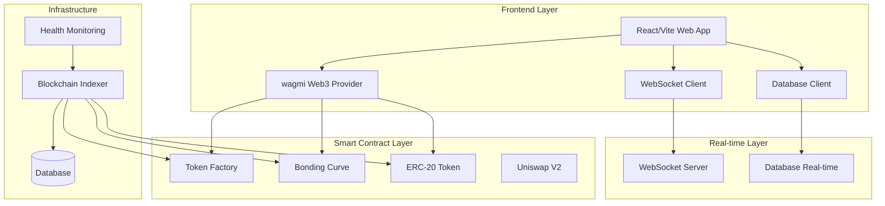

# 🛠️ Developer Integration Guide

<div align="center">


**Complete Technical Integration Guide for RAVO Protocol**

*Build powerful DeFi applications with RAVO's Virtual Bonding Curve technology*

</div>

---

## 📋 Table of Contents

- [Prerequisites](#prerequisites)
- [Architecture Overview](#architecture-overview)
- [Smart Contract Integration](#smart-contract-integration)
- [API Integration](#api-integration)
- [WebSocket Streams](#websocket-streams)
- [Security Best Practices](#security-best-practices)
- [Testing & Deployment](#testing--deployment)

---

## 🔧 Prerequisites

### **System Requirements**

```bash
# Required tools
Node.js >= 18.0.0
npm
Git
MetaMask, Coinbase Wallet, or compatible Web3 wallet
```

### **Technology Stack Overview**

| **Layer** | **Technology** | **Purpose** |
|-----------|----------------|-------------|
| **Frontend** | React 18 + TypeScript + Vite | User interface and interactions |
| **Styling** | Tailwind CSS + shadcn/ui | Responsive design and components |
| **Web3** | wagmi + viem + Reown | Blockchain connectivity |
| **Database** | PostgreSQL | Data storage and real-time updates |
| **Real-time** | WebSocket + Real-time Database | Live price feeds and notifications |
| **Charts** | TradingVue.js + Lightweight Charts | Trading interface and analytics |
| **State Management** | React Context + Database | Application state |

### **Network Requirements**

- **Mainnet**: Ethereum mainnet for production
- **Testnet**: Sepolia testnet for development
- **RPC Providers**: Multiple providers for redundancy
- **WebSocket**: Real-time data streaming

---

## 🏗️ Architecture Overview

### **System Architecture**



### **Core Components**

#### **Token Factory Contract**
- **Address**: `0xa6b924e602eB9E8f6715439fd8C0111A3b4155C2` (Sepolia)
- **Purpose**: Creates new tokens and bonding curves
- **Gas Optimized**: Minimal deployment costs

#### **Bonding Curve Contract**
- **Dynamic Deployment**: New instance per token
- **Security Features**: Advanced security protocols and encryption
- **Custom Migration Threshold**: Token creators can set their own migration threshold
- **Auto-Migration**: Seamless Uniswap integration when threshold is reached

#### **ERC-20 Token Contract**
- **Standard Compliance**: Full ERC-20 implementation
- **Enhanced Features**: Social links, descriptions, trading controls
- **Owner Management**: Transferable ownership with renounce capability

---

## 🔧 Smart Contract Integration

### **Contract Addresses**

```javascript
// Sepolia Testnet Addresses (Current)
const CONTRACTS = {
  FACTORY: '0x1F2219162955396B9d5140d71d2C8832F5471253',
  UNISWAP_ROUTER: '0xeE567Fe1712Faf6149d80dA1E6934E354124CfE3',
  UNISWAP_FACTORY: '0xF62c03E08ada871A0bEb309762E260a7a6a88075',
  WETH: '0x7b79995e5f793A07Bc00c21412e50Ecae098E7f9'
};

// Mainnet Addresses (Future deployment)
const MAINNET_CONTRACTS = {
  FACTORY: '0x...', // To be deployed
  // ... other addresses
};
```

### **Creating Tokens Programmatically**

```javascript
import { ethers } from 'ethers';

const FACTORY_ABI = [
  {
    "inputs": [
      {"internalType": "string", "name": "name", "type": "string"},
      {"internalType": "string", "name": "symbol", "type": "string"},
      {"internalType": "string", "name": "telegram", "type": "string"},
      {"internalType": "string", "name": "website", "type": "string"},
      {"internalType": "string", "name": "xProfile", "type": "string"},
      {"internalType": "string", "name": "description", "type": "string"},
      {"internalType": "uint256", "name": "migrationThreshold", "type": "uint256"},
      {"internalType": "uint256", "name": "initialBuyAmount", "type": "uint256"},
      {"internalType": "uint256", "name": "launchTimestamp", "type": "uint256"}
    ],
    "name": "createToken",
    "outputs": [],
    "stateMutability": "payable",
    "type": "function"
  },
  {
    "anonymous": false,
    "inputs": [
      {"indexed": true, "internalType": "address", "name": "token", "type": "address"},
      {"indexed": true, "internalType": "address", "name": "bondingCurve", "type": "address"},
      {"indexed": true, "internalType": "address", "name": "creator", "type": "address"},
      {"indexed": false, "internalType": "uint256", "name": "launchTimestamp", "type": "uint256"}
    ],
    "name": "TokenCreated",
    "type": "event"
  }
];

async function createToken() {
  const provider = new ethers.providers.Web3Provider(window.ethereum);
  const signer = provider.getSigner();

  const factory = new ethers.Contract(
    CONTRACTS.FACTORY,
    FACTORY_ABI,
    signer
  );

  // Calculate total value (creation fee + initial buy)
  const creationFee = ethers.utils.parseEther('0.0001'); // From environment
  const initialBuyAmount = ethers.utils.parseEther('0.1');
  const totalValue = creationFee.add(initialBuyAmount);

  // Create token
  const tx = await factory.createToken(
    'My Awesome Token',        // name
    'MAT',                     // symbol
    'https://t.me/mytoken',    // telegram
    'https://mytoken.com',     // website
    'https://x.com/mytoken',   // twitter
    'Revolutionary DeFi project', // description
    ethers.utils.parseEther('0.005'), // migration threshold
    initialBuyAmount,          // initial buy amount
    0,                         // launch timestamp (0 = immediate)
    { value: totalValue }
  );

  // Wait for transaction
  const receipt = await tx.wait();

  // Parse TokenCreated event
  const tokenCreatedEvent = receipt.events.find(
    event => event.event === 'TokenCreated'
  );

  if (tokenCreatedEvent) {
    const { token, bondingCurve, creator } = tokenCreatedEvent.args;
    console.log('Token created:', {
      tokenAddress: token,
      bondingCurveAddress: bondingCurve,
      creator: creator
    });
  }

  return receipt;
}
```

### **Trading Functions**

```javascript
const BONDING_CURVE_ABI = [
  // Buy tokens
  {
    "inputs": [
      {"internalType": "uint256", "name": "slippagePercent", "type": "uint256"}
    ],
    "name": "buyTokens",
    "outputs": [{"internalType": "uint256", "name": "", "type": "uint256"}],
    "stateMutability": "payable",
    "type": "function"
  },

  // Sell tokens
  {
    "inputs": [
      {"internalType": "uint256", "name": "tokenAmount", "type": "uint256"},
      {"internalType": "uint256", "name": "slippagePercent", "type": "uint256"}
    ],
    "name": "sellTokens",
    "outputs": [],
    "stateMutability": "nonpayable",
    "type": "function"
  },

  // Estimate functions
  {
    "inputs": [{"internalType": "uint256", "name": "ethAmount", "type": "uint256"}],
    "name": "estimateBuyTokens",
    "outputs": [{"internalType": "uint256", "name": "", "type": "uint256"}],
    "stateMutability": "view",
    "type": "function"
  },

  {
    "inputs": [{"internalType": "uint256", "name": "tokenAmount", "type": "uint256"}],
    "name": "estimateSellETH",
    "outputs": [{"internalType": "uint256", "name": "", "type": "uint256"}],
    "stateMutability": "view",
    "type": "function"
  },

  // Migration status
  {
    "inputs": [],
    "name": "getMigrationStatus",
    "outputs": [
      {"internalType": "bool", "name": "_migrated", "type": "bool"},
      {"internalType": "bool", "name": "_isMigrating", "type": "bool"},
      {"internalType": "bool", "name": "_canRetry", "type": "bool"}
    ],
    "stateMutability": "view",
    "type": "function"
  }
];

async function buyTokens(bondingCurveAddress, ethAmount, slippagePercent = 2) {
  const provider = new ethers.providers.Web3Provider(window.ethereum);
  const signer = provider.getSigner();

  const bondingCurve = new ethers.Contract(
    bondingCurveAddress,
    BONDING_CURVE_ABI,
    signer
  );

  // Estimate tokens to receive
  const estimatedTokens = await bondingCurve.estimateBuyTokens(
    ethers.utils.parseEther(ethAmount.toString())
  );

  console.log(`Estimated tokens: ${ethers.utils.formatEther(estimatedTokens)}`);

  // Execute buy with slippage protection
  const tx = await bondingCurve.buyTokens(slippagePercent, {
    value: ethers.utils.parseEther(ethAmount.toString())
  });

  const receipt = await tx.wait();
  console.log('Buy transaction confirmed:', receipt.transactionHash);

  return receipt;
}

async function sellTokens(bondingCurveAddress, tokenAmount, slippagePercent = 2) {
  const provider = new ethers.providers.Web3Provider(window.ethereum);
  const signer = provider.getSigner();

  const bondingCurve = new ethers.Contract(
    bondingCurveAddress,
    BONDING_CURVE_ABI,
    signer
  );

  // First approve tokens for spending
  const tokenAddress = await bondingCurve.token();
  const token = new ethers.Contract(tokenAddress, ERC20_ABI, signer);

  await token.approve(bondingCurveAddress, ethers.utils.parseEther(tokenAmount.toString()));

  // Estimate ETH to receive
  const estimatedETH = await bondingCurve.estimateSellETH(
    ethers.utils.parseEther(tokenAmount.toString())
  );

  console.log(`Estimated ETH: ${ethers.utils.formatEther(estimatedETH)}`);

  // Execute sell
  const tx = await bondingCurve.sellTokens(
    ethers.utils.parseEther(tokenAmount.toString()),
    slippagePercent
  );

  const receipt = await tx.wait();
  console.log('Sell transaction confirmed:', receipt.transactionHash);

  return receipt;
}
```

### **Token Management**

```javascript
const TOKEN_ABI = [
  // Read functions
  {
    "inputs": [],
    "name": "name",
    "outputs": [{"internalType": "string", "name": "", "type": "string"}],
    "stateMutability": "view",
    "type": "function"
  },

  {
    "inputs": [],
    "name": "symbol",
    "outputs": [{"internalType": "string", "name": "", "type": "string"}],
    "stateMutability": "view",
    "type": "function"
  },

  {
    "inputs": [],
    "name": "totalSupply",
    "outputs": [{"internalType": "uint256", "name": "", "type": "uint256"}],
    "stateMutability": "view",
    "type": "function"
  },

  {
    "inputs": [{"internalType": "address", "name": "account", "type": "address"}],
    "name": "balanceOf",
    "outputs": [{"internalType": "uint256", "name": "", "type": "uint256"}],
    "stateMutability": "view",
    "type": "function"
  },

  // Owner functions
  {
    "inputs": [{"internalType": "string", "name": "_description", "type": "string"}],
    "name": "setDescription",
    "outputs": [],
    "stateMutability": "nonpayable",
    "type": "function"
  },

  {
    "inputs": [
      {"internalType": "string", "name": "_telegram", "type": "string"},
      {"internalType": "string", "name": "_website", "type": "string"},
      {"internalType": "string", "name": "_xProfile", "type": "string"}
    ],
    "name": "setSocialLinks",
    "outputs": [],
    "stateMutability": "nonpayable",
    "type": "function"
  },

  {
    "inputs": [],
    "name": "openTradingNow",
    "outputs": [],
    "stateMutability": "nonpayable",
    "type": "function"
  }
];

async function updateTokenMetadata(tokenAddress) {
  const provider = new ethers.providers.Web3Provider(window.ethereum);
  const signer = provider.getSigner();

  const token = new ethers.Contract(tokenAddress, TOKEN_ABI, signer);

  // Update description
  await token.setDescription('Updated project description with new features');

  // Update social links
  await token.setSocialLinks(
    'https://t.me/updatedchannel',
    'https://updatedwebsite.com',
    'https://x.com/updatedhandle'
  );

  console.log('Token metadata updated successfully');
}
```

---

## 🎯 Custom Migration Threshold Feature

### **Understanding Migration Thresholds**

The **Custom Migration Threshold** is one of RAVO's most important innovations, allowing token creators to control when their token migrates from the bonding curve to Uniswap V2.

#### **How It Works**

```javascript
// Migration threshold determines when automatic migration occurs
const migrationThreshold = parseEther("0.005"); // 0.005 ETH

// When bonding curve ETH balance reaches this threshold:
// 1. Trading is temporarily disabled
// 2. All ETH and tokens are used to create Uniswap liquidity
// 3. Token graduates to Uniswap V2 for full DEX trading
```

#### **Migration Threshold Parameters**

| **Parameter** | **Type** | **Description** | **Constraints** |
|---------------|----------|-----------------|-----------------|
| `migrationThreshold` | `uint256` | ETH amount required for migration | `>= 0.00019 ETH` |
| `minThreshold` | `uint256` | Minimum allowed threshold | `0.00019 ETH` (enforced) |
| `currentBalance` | `uint256` | Current ETH in bonding curve | Real-time value |

#### **Migration Threshold Examples**

```javascript
// Conservative approach - more bonding curve trading
const conservativeThreshold = parseEther("0.01");   // 0.01 ETH
// Benefits: More time on bonding curve, higher liquidity before Uniswap

// Balanced approach - moderate threshold
const balancedThreshold = parseEther("0.005");      // 0.005 ETH  
// Benefits: Good balance between bonding curve and Uniswap phases

// Aggressive approach - quick Uniswap migration
const aggressiveThreshold = parseEther("0.001");    // 0.001 ETH
// Benefits: Fast Uniswap access, immediate DEX exposure
```

#### **Migration Process Flow**

```javascript
// 1. Token creation with custom threshold
const tx = await factory.createToken(
  "MyToken",
  "MTK", 
  "https://t.me/mytoken",
  "https://mytoken.com",
  "https://x.com/mytoken",
  "My awesome project",
  parseEther("0.005"), // Custom migration threshold
  parseEther("0.1"),   // Initial buy amount
  0                    // Launch timestamp
);

// 2. Monitor migration progress
const bondingCurve = new ethers.Contract(bondingCurveAddress, BONDING_CURVE_ABI, provider);

// Get current migration status
const [migrated, isMigrating, canRetry] = await bondingCurve.getMigrationStatus();
const progress = await bondingCurve.getProgress(); // Percentage towards migration
const currentBalance = await provider.getBalance(bondingCurveAddress);

console.log({
  migrated,           // false
  isMigrating,        // false  
  canRetry,          // false
  progress,          // 25 (25% towards migration)
  currentBalance,    // 0.00125 ETH
  threshold: "0.005 ETH"
});

// 3. Migration triggers automatically when threshold reached
// No manual intervention required - fully automated
```

#### **Migration Threshold Benefits**

##### **For Token Creators**
- **🎯 Strategic Control**: Choose optimal migration timing
- **📈 Market Strategy**: Align migration with project milestones
- **💰 Liquidity Planning**: Control pre-Uniswap liquidity amount
- **🚀 Growth Management**: Balance bonding curve vs Uniswap phases

##### **For Traders**
- **📊 Predictable Migration**: Clear threshold visibility
- **⚡ Fair Access**: Equal opportunity during bonding curve phase
- **🔄 Seamless Transition**: Automatic migration without manual intervention
- **📈 Enhanced Liquidity**: Gradual liquidity increase before Uniswap

#### **Migration Threshold Best Practices**

```javascript
// 1. Consider your project goals
const projectGoals = {
  quickUniswapAccess: parseEther("0.001"),    // Fast DEX exposure
  balancedApproach: parseEther("0.005"),      // Moderate threshold
  extendedBondingCurve: parseEther("0.01")    // More bonding curve trading
};

// 2. Factor in market conditions
const marketConditions = {
  bullMarket: parseEther("0.003"),    // Lower threshold for faster growth
  bearMarket: parseEther("0.008"),    // Higher threshold for stability
  volatileMarket: parseEther("0.005") // Balanced approach
};

// 3. Consider tokenomics
const tokenomics = {
  highSupply: parseEther("0.01"),     // Higher threshold for large supply
  lowSupply: parseEther("0.002"),     // Lower threshold for small supply
  standardSupply: parseEther("0.005") // Standard threshold
};
```

#### **Migration Monitoring**

```javascript
// Real-time migration monitoring
class MigrationMonitor {
  constructor(bondingCurveAddress, provider) {
    this.bondingCurve = new ethers.Contract(bondingCurveAddress, BONDING_CURVE_ABI, provider);
  }

  async getMigrationStatus() {
    const [migrated, isMigrating, canRetry] = await this.bondingCurve.getMigrationStatus();
    const progress = await this.bondingCurve.getProgress();
    const currentBalance = await this.bondingCurve.provider.getBalance(this.bondingCurve.address);
    const threshold = await this.bondingCurve.migrationThreshold();
    
    return {
      migrated,
      isMigrating,
      canRetry,
      progress,
      currentBalance: ethers.utils.formatEther(currentBalance),
      threshold: ethers.utils.formatEther(threshold),
      remaining: ethers.utils.formatEther(threshold.sub(currentBalance))
    };
  }

  // Monitor migration progress
  async monitorProgress(callback) {
    const status = await this.getMigrationStatus();
    callback(status);
    
    if (!status.migrated && !status.isMigrating) {
      // Continue monitoring
      setTimeout(() => this.monitorProgress(callback), 5000);
    }
  }
}

// Usage
const monitor = new MigrationMonitor(bondingCurveAddress, provider);
monitor.monitorProgress((status) => {
  console.log(`Migration Progress: ${status.progress}%`);
  console.log(`Current Balance: ${status.currentBalance} ETH`);
  console.log(`Threshold: ${status.threshold} ETH`);
  console.log(`Remaining: ${status.remaining} ETH`);
});
```

---

## 🔗 API Integration

### **WebSocket API Endpoints**

Based on your WebSocket server implementation, here are the available API endpoints:

#### **Connection Management**

```javascript
// Connect to WebSocket server
const ws = new WebSocket('wss://your-domain.ngrok.io');

// Send connection message (automatic on connect)
ws.onopen = () => {
  console.log('Connected to RAVO WebSocket server');
};
```

#### **Subscription API**

```javascript
// Subscribe to channels
const subscribeMessage = {
  type: 'subscribe',
  data: {
    channel: 'all_events',        // Channel name
    tokenAddress: '0x...'         // Optional: for token-specific channels
  }
};

ws.send(JSON.stringify(subscribeMessage));

// Unsubscribe from channels
const unsubscribeMessage = {
  type: 'unsubscribe',
  data: {
    channel: 'all_events',
    tokenAddress: '0x...'
  }
};

ws.send(JSON.stringify(unsubscribeMessage));
```

#### **Data Request API**

```javascript
// Get tokens data
const getTokensMessage = {
  type: 'get_tokens',
  data: {
    filter: 'active',    // 'all', 'active', 'live', 'migrated'
    limit: 50,
    offset: 0
  }
};

ws.send(JSON.stringify(getTokensMessage));

// Get transactions for specific token
const getTransactionsMessage = {
  type: 'get_transactions',
  data: {
    tokenAddress: '0x1F2219162955396B9d5140d71d2C8832F5471253',
    limit: 50,
    offset: 0
  }
};

ws.send(JSON.stringify(getTransactionsMessage));

// Get chart data
const getChartMessage = {
  type: 'get_chart',
  data: {
    tokenAddress: '0x1F2219162955396B9d5140d71d2C8832F5471253',
    timeframe: '1h',     // '1m', '5m', '15m', '1h', '4h', '1d'
    limit: 100
  }
};

ws.send(JSON.stringify(getChartMessage));
```

#### **Heartbeat API**

```javascript
// Send ping to server
const pingMessage = {
  type: 'ping'
};

ws.send(JSON.stringify(pingMessage));

// Server responds with pong
ws.onmessage = (event) => {
  const message = JSON.parse(event.data);
  if (message.type === 'pong') {
    console.log('Server pong received:', message.data.timestamp);
  }
};
```

### **Response Message Types**

#### **Connection Responses**

```javascript
// Connection established
{
  type: 'connection',
  data: {
    clientId: 'client_abc123_1234567890',
    message: 'Connected to RAVO WebSocket Server',
    serverTime: 1234567890123,
    availableChannels: [
      'all_events',
      'token_creation', 
      'token_trades',
      'market_updates',
      'migration_events',
      'all_tokens',
      'trending',
      'recently_migrated'
    ]
  }
}

// Subscription success
{
  type: 'subscription_success',
  data: {
    channel: 'all_events',
    message: 'Successfully subscribed to all_events'
  }
}

// Unsubscription confirmation
{
  type: 'unsubscription_confirmed',
  data: {
    channel: 'all_events',
    message: 'Unsubscribed from all_events'
  }
}
```

#### **Data Responses**

```javascript
// Tokens response
{
  type: 'tokens_response',
  data: [
    {
      address: '0x1F2219162955396B9d5140d71d2C8832F5471253',
      name: 'My Token',
      symbol: 'MTK',
      creator: '0x...',
      bonding_curve: '0x...',
      description: 'Token description',
      migration_status: 'Live',
      current_price: 0.0001,
      market_cap: 10000,
      volume_24h: 5000,
      created_at: '2025-01-01T00:00:00.000Z'
    }
    // ... more tokens
  ]
}

// Transactions response
{
  type: 'transactions_response',
  data: [
    {
      hash: '0x...',
      token_address: '0x1F2219162955396B9d5140d71d2C8832F5471253',
      type: 'buy',
      trader: '0x...',
      amount: '1000.0',
      value: '0.1',
      timestamp: 1234567890,
      block_number: 12345678
    }
    // ... more transactions
  ]
}

// Chart response
{
  type: 'chart_response',
  data: [
    {
      token_address: '0x1F2219162955396B9d5140d71d2C8832F5471253',
      timeframe: '1h',
      timestamp: 1234567890,
      open: 0.0001,
      high: 0.0002,
      low: 0.00005,
      close: 0.00015,
      volume: 1000.0
    }
    // ... more candlestick data
  ]
}
```

### **Error Handling**

```javascript
// Error response
{
  type: 'error',
  data: {
    message: 'Rate limit exceeded'
  }
}

// Handle errors
ws.onmessage = (event) => {
  const message = JSON.parse(event.data);
  
  if (message.type === 'error') {
    console.error('WebSocket error:', message.data.message);
    
    switch (message.data.message) {
      case 'Rate limit exceeded':
        // Implement backoff strategy
        setTimeout(() => {
          ws.close();
          ws = new WebSocket('wss://your-domain.ngrok.io');
        }, 60000);
        break;
        
      case 'Invalid message format':
        console.error('Message format error - check your JSON');
        break;
        
      default:
        console.error('Unknown error:', message.data.message);
    }
  }
};
```

### **Complete API Client Implementation**

```javascript
class RAVOApiClient {
  constructor(wsUrl) {
    this.wsUrl = wsUrl;
    this.ws = null;
    this.subscriptions = new Map();
    this.messageHandlers = new Map();
    this.isConnected = false;
  }

  async connect() {
    return new Promise((resolve, reject) => {
      this.ws = new WebSocket(this.wsUrl);
      
      this.ws.onopen = () => {
        this.isConnected = true;
        console.log('✅ Connected to RAVO API');
        resolve();
      };
      
      this.ws.onmessage = (event) => {
        this.handleMessage(JSON.parse(event.data));
      };
      
      this.ws.onclose = () => {
        this.isConnected = false;
        console.log('🔌 Disconnected from RAVO API');
      };
      
      this.ws.onerror = (error) => {
        console.error('❌ WebSocket error:', error);
        reject(error);
      };
    });
  }

  handleMessage(message) {
    const { type, data } = message;
    
    // Call registered handlers
    if (this.messageHandlers.has(type)) {
      this.messageHandlers.get(type).forEach(handler => {
        handler(data);
      });
    }
  }

  onMessageType(type, handler) {
    if (!this.messageHandlers.has(type)) {
      this.messageHandlers.set(type, []);
    }
    this.messageHandlers.get(type).push(handler);
  }

  subscribe(channel, tokenAddress = null) {
    if (!this.isConnected) {
      throw new Error('Not connected to WebSocket');
    }

    const message = {
      type: 'subscribe',
      data: { channel, tokenAddress }
    };

    this.ws.send(JSON.stringify(message));
    
    const key = tokenAddress ? `${channel}_${tokenAddress}` : channel;
    this.subscriptions.set(key, { channel, tokenAddress });
  }

  unsubscribe(channel, tokenAddress = null) {
    if (!this.isConnected) return;

    const message = {
      type: 'unsubscribe',
      data: { channel, tokenAddress }
    };

    this.ws.send(JSON.stringify(message));
    
    const key = tokenAddress ? `${channel}_${tokenAddress}` : channel;
    this.subscriptions.delete(key);
  }

  getTokens(filter = 'all', limit = 50, offset = 0) {
    if (!this.isConnected) {
      throw new Error('Not connected to WebSocket');
    }

    const message = {
      type: 'get_tokens',
      data: { filter, limit, offset }
    };

    this.ws.send(JSON.stringify(message));
  }

  getTransactions(tokenAddress, limit = 50, offset = 0) {
    if (!this.isConnected) {
      throw new Error('Not connected to WebSocket');
    }

    const message = {
      type: 'get_transactions',
      data: { tokenAddress, limit, offset }
    };

    this.ws.send(JSON.stringify(message));
  }

  getChart(tokenAddress, timeframe = '1h', limit = 100) {
    if (!this.isConnected) {
      throw new Error('Not connected to WebSocket');
    }

    const message = {
      type: 'get_chart',
      data: { tokenAddress, timeframe, limit }
    };

    this.ws.send(JSON.stringify(message));
  }

  ping() {
    if (!this.isConnected) return;

    const message = { type: 'ping' };
    this.ws.send(JSON.stringify(message));
  }

  disconnect() {
    if (this.ws) {
      this.ws.close();
      this.isConnected = false;
    }
  }
}

// Usage example
const apiClient = new RAVOApiClient('wss://your-domain.ngrok.io');

// Connect and set up handlers
await apiClient.connect();

// Set up event handlers
apiClient.onMessageType('tokens_response', (tokens) => {
  console.log('Received tokens:', tokens);
});

apiClient.onMessageType('transactions_response', (transactions) => {
  console.log('Received transactions:', transactions);
});

apiClient.onMessageType('chart_response', (chartData) => {
  console.log('Received chart data:', chartData);
});

// Subscribe to real-time events
apiClient.subscribe('all_events');

// Request data
apiClient.getTokens('active', 20, 0);
apiClient.getTransactions('0x1F2219162955396B9d5140d71d2C8832F5471253', 50, 0);
apiClient.getChart('0x1F2219162955396B9d5140d71d2C8832F5471253', '1h', 100);
```

---

## 🔗 API Integration

### **WebSocket API Endpoints**

Based on your WebSocket server implementation, here are the available API endpoints:

```javascript
import { createClient } from '@database/client';

const databaseUrl = process.env.NEXT_PUBLIC_DATABASE_URL;
const databaseKey = process.env.NEXT_PUBLIC_DATABASE_ANON_KEY;

const database = createClient(databaseUrl, databaseKey);

// Get token list with real-time updates
async function getTokens(options = {}) {
  const {
    page = 1,
    limit = 50,
    sortBy = 'created_at',
    sortOrder = 'desc'
  } = options;

  const from = (page - 1) * limit;
  const to = from + limit - 1;

  const { data, error, count } = await database
    .from('tokens')
    .select('*', { count: 'exact' })
    .range(from, to)
    .order(sortBy, { ascending: sortOrder === 'asc' });

  if (error) throw error;

  return {
    tokens: data,
    totalCount: count,
    currentPage: page,
    totalPages: Math.ceil(count / limit)
  };
}

// Get specific token with relationships
async function getToken(tokenAddress) {
  const { data, error } = await database
    .from('tokens')
    .select(`
      *,
      transactions (*),
      token_stats (*)
    `)
    .eq('address', tokenAddress)
    .single();

  if (error) throw error;

  return data;
}

// Subscribe to real-time token updates
function subscribeToTokenUpdates(tokenAddress, callback) {
  const subscription = database
    .channel(`token_${tokenAddress}`)
    .on(
      'postgres_changes',
      {
        event: '*',
        schema: 'public',
        table: 'transactions',
        filter: `token_address=eq.${tokenAddress}`
      },
      (payload) => {
        callback(payload);
      }
    )
    .subscribe();

  return subscription;
}

// Get trade history with pagination
async function getTradeHistory(tokenAddress, options = {}) {
  const {
    page = 1,
    limit = 100,
    sortBy = 'timestamp',
    sortOrder = 'desc'
  } = options;

  const from = (page - 1) * limit;
  const to = from + limit - 1;

  const { data, error } = await database
    .from('transactions')
    .select('*')
    .eq('token_address', tokenAddress)
    .range(from, to)
    .order(sortBy, { ascending: sortOrder === 'asc' });

  if (error) throw error;

  return data;
}

### **Advanced Database Usage**

```javascript
class RAVODataClient {
  constructor() {
    this.database = createClient(
      process.env.NEXT_PUBLIC_DATABASE_URL,
      process.env.NEXT_PUBLIC_DATABASE_ANON_KEY
    );
  }

  // Advanced token queries with filters
  async getFilteredTokens(filters = {}) {
    let query = this.database.from('tokens').select('*');

    // Apply filters
    if (filters.symbol) {
      query = query.ilike('symbol', `%${filters.symbol}%`);
    }

    if (filters.creator) {
      query = query.eq('creator_address', filters.creator);
    }

    if (filters.migrationStatus) {
      query = query.eq('migration_status', filters.migrationStatus);
    }

    if (filters.priceRange) {
      const { min, max } = filters.priceRange;
      query = query.gte('current_price', min).lte('current_price', max);
    }

    if (filters.sortBy) {
      const ascending = filters.sortOrder === 'asc';
      query = query.order(filters.sortBy, { ascending });
    }

    const { data, error } = await query;
    if (error) throw error;

    return data;
  }

  // Real-time analytics subscription
  subscribeToAnalytics(tokenAddress, callback) {
    const subscription = this.database
      .channel(`analytics_${tokenAddress}`)
      .on(
        'postgres_changes',
        {
          event: '*',
          schema: 'public',
          table: 'token_stats',
          filter: `token_address=eq.${tokenAddress}`
        },
        (payload) => {
          callback(payload.new);
        }
      )
      .subscribe();

    return subscription;
  }

  // Batch operations for performance
  async batchUpdateTokenStats(updates) {
    const { data, error } = await this.database
      .from('token_stats')
      .upsert(updates, {
        onConflict: 'token_address',
        ignoreDuplicates: false
      });

    if (error) throw error;
    return data;
  }

  // Complex analytics queries
  async getTokenAnalytics(tokenAddress, timeframe = '24h') {
    const startTime = new Date();
    startTime.setHours(startTime.getHours() - parseInt(timeframe));

    const { data, error } = await this.database
      .from('transactions')
      .select(`
        amount,
        price,
        transaction_type,
        timestamp,
        buyer_address,
        seller_address
      `)
      .eq('token_address', tokenAddress)
      .gte('timestamp', startTime.toISOString())
      .order('timestamp', { ascending: false });

    if (error) throw error;

    // Calculate analytics
    const analytics = {
      volume24h: data.reduce((sum, tx) => sum + parseFloat(tx.amount), 0),
      transactions24h: data.length,
      uniqueTraders: new Set([
        ...data.map(tx => tx.buyer_address),
        ...data.map(tx => tx.seller_address)
      ]).size,
      priceChange24h: this.calculatePriceChange(data),
      topHolders: this.calculateTopHolders(data)
    };

    return analytics;
  }

  calculatePriceChange(transactions) {
    if (transactions.length < 2) return 0;

    const sortedTx = transactions.sort((a, b) =>
      new Date(a.timestamp) - new Date(b.timestamp)
    );

    const firstPrice = sortedTx[0].price;
    const lastPrice = sortedTx[sortedTx.length - 1].price;

    return ((lastPrice - firstPrice) / firstPrice) * 100;
  }

  calculateTopHolders(transactions) {
    const holderBalances = {};

    transactions.forEach(tx => {
      if (tx.buyer_address) {
        holderBalances[tx.buyer_address] =
          (holderBalances[tx.buyer_address] || 0) + parseFloat(tx.amount);
      }
      if (tx.seller_address) {
        holderBalances[tx.seller_address] =
          (holderBalances[tx.seller_address] || 0) - parseFloat(tx.amount);
      }
    });

    return Object.entries(holderBalances)
      .sort(([,a], [,b]) => b - a)
      .slice(0, 10)
      .map(([address, balance]) => ({ address, balance }));
  }
}

// Usage example
const ravoClient = new RAVODataClient();

try {
  // Get filtered tokens
  const filteredTokens = await ravoClient.getFilteredTokens({
    migrationStatus: 'Live',
    sortBy: 'created_at',
    sortOrder: 'desc'
  });

  // Subscribe to analytics
  const unsubscribe = ravoClient.subscribeToAnalytics(
    '0x123...',
    (analytics) => {
      console.log('Real-time analytics:', analytics);
    }
  );

  // Get complex analytics
  const analytics = await ravoClient.getTokenAnalytics('0x123...', '7d');
  console.log('7-day Analytics:', analytics);

} catch (error) {
  console.error('Database Error:', error.message);
}
```

---

## 🌐 Real-Time Data Integration

### **Real-Time Database Subscriptions**

```javascript
import { createClient } from '@database/client';
import { RealtimeChannel } from '@database/client';

class RAVORealtimeClient {
  constructor() {
    this.database = createClient(
      process.env.NEXT_PUBLIC_DATABASE_URL,
      process.env.NEXT_PUBLIC_DATABASE_ANON_KEY
    );
    this.subscriptions = new Map();
  }

  // Subscribe to token price updates
  subscribeToTokenPrices(tokenAddress, callback) {
    const channelName = `token_price_${tokenAddress}`;

    const channel = this.database
      .channel(channelName)
      .on(
        'postgres_changes',
        {
          event: 'UPDATE',
          schema: 'public',
          table: 'token_stats',
          filter: `token_address=eq.${tokenAddress}`
        },
        (payload) => {
          callback({
            type: 'price_update',
            tokenAddress,
            newPrice: payload.new.current_price,
            priceChange: payload.new.price_change_24h,
            volume24h: payload.new.volume_24h,
            timestamp: new Date().toISOString()
          });
        }
      )
      .subscribe();

    this.subscriptions.set(channelName, channel);
    return channelName;
  }

  // Subscribe to new transactions
  subscribeToTransactions(tokenAddress, callback) {
    const channelName = `transactions_${tokenAddress}`;

    const channel = this.database
      .channel(channelName)
      .on(
        'postgres_changes',
        {
          event: 'INSERT',
          schema: 'public',
          table: 'transactions',
          filter: `token_address=eq.${tokenAddress}`
        },
        (payload) => {
          callback({
            type: 'new_transaction',
            transaction: payload.new,
            tokenAddress,
            timestamp: new Date().toISOString()
          });
        }
      )
      .subscribe();

    this.subscriptions.set(channelName, channel);
    return channelName;
  }

  // Subscribe to migration events
  subscribeToMigrations(callback) {
    const channelName = 'migrations';

    const channel = this.database
      .channel(channelName)
      .on(
        'postgres_changes',
        {
          event: 'UPDATE',
          schema: 'public',
          table: 'tokens',
          filter: 'migration_status=eq.Migrating'
        },
        (payload) => {
          callback({
            type: 'migration_started',
            tokenAddress: payload.new.address,
            migrationStatus: payload.new.migration_status,
            timestamp: new Date().toISOString()
          });
        }
      )
      .on(
        'postgres_changes',
        {
          event: 'UPDATE',
          schema: 'public',
          table: 'tokens',
          filter: 'migration_status=eq.Migrated'
        },
        (payload) => {
          callback({
            type: 'migration_completed',
            tokenAddress: payload.new.address,
            uniswapPair: payload.new.uniswap_pair_address,
            timestamp: new Date().toISOString()
          });
        }
      )
      .subscribe();

    this.subscriptions.set(channelName, channel);
    return channelName;
  }

  // Unsubscribe from specific channel
  unsubscribe(channelName) {
    const channel = this.subscriptions.get(channelName);
    if (channel) {
      this.database.removeChannel(channel);
      this.subscriptions.delete(channelName);
    }
  }

  // Unsubscribe from all channels
  unsubscribeAll() {
    for (const [channelName, channel] of this.subscriptions) {
      this.database.removeChannel(channel);
    }
    this.subscriptions.clear();
  }
}

// Usage example
const realtimeClient = new RAVORealtimeClient();

// Subscribe to multiple data streams
const priceSubscription = realtimeClient.subscribeToTokenPrices(
  '0x1F2219162955396B9d5140d71d2C8832F5471253',
  (update) => {
    console.log('Price update:', update);
    // Update price display
    updatePriceDisplay(update.newPrice);
  }
);

const transactionSubscription = realtimeClient.subscribeToTransactions(
  '0x1F2219162955396B9d5140d71d2C8832F5471253',
  (transaction) => {
    console.log('New transaction:', transaction);
    // Add to transaction list
    addTransactionToList(transaction.transaction);
  }
);

const migrationSubscription = realtimeClient.subscribeToMigrations(
  (migration) => {
    console.log('Migration event:', migration);
    // Update migration status
    updateMigrationStatus(migration);
  }
);

// Cleanup when component unmounts
function cleanup() {
  realtimeClient.unsubscribeAll();
}
```

---

## 📡 WebSocket Streams

### **WebSocket Server Configuration**

The RAVO WebSocket server provides real-time data streaming for all platform events. It's designed to handle 500k+ concurrent users with horizontal scaling support.

#### **Connection Details**

```javascript
// WebSocket connection configuration
const WS_CONFIG = {
  // Local development
  LOCAL_URL: 'ws://localhost:8080',
  
  // Production (with ngrok tunnel)
  PRODUCTION_URL: 'wss://your-domain.ngrok.io',
  
  // Connection settings
  RECONNECT_INTERVAL: 5000,
  MAX_RECONNECT_ATTEMPTS: 10,
  HEARTBEAT_INTERVAL: 30000,
  CONNECTION_TIMEOUT: 300000
};
```

#### **Available Channels**

Based on your WebSocket server implementation, here are the supported channels:

```javascript
const CHANNELS = {
  // Website-compatible channels (primary)
  ALL_EVENTS: 'all_events',           // All platform events
  TOKEN_CREATION: 'token_creation',   // New token creation events
  TOKEN_TRADES: 'token_trades',       // Buy/sell transactions
  MARKET_UPDATES: 'market_updates',   // Price and market data
  MIGRATION_EVENTS: 'migration_events', // Token migration events
  
  // Legacy channels (backward compatibility)
  ALL_TOKENS: 'all_tokens',           // All active tokens
  TOKEN_SPECIFIC: 'token_',           // Token-specific data (append address)
  TRENDING: 'trending',               // Trending tokens
  RECENTLY_MIGRATED: 'recently_migrated', // Recently migrated tokens
  TRANSACTIONS: 'transactions_',      // Token transactions (append address)
  CHARTS: 'charts_',                  // Chart data (append address)
  MARKET_STATUS: 'market_status_'     // Market status (append address)
};
```

### **WebSocket Client Implementation**

```javascript
class RAVOWebSocketClient {
  constructor(config = {}) {
    this.config = { ...WS_CONFIG, ...config };
    this.ws = null;
    this.subscriptions = new Map();
    this.reconnectAttempts = 0;
    this.isConnected = false;
    this.messageHandlers = new Map();
  }

  // Connect to WebSocket server
  connect() {
    return new Promise((resolve, reject) => {
      try {
        this.ws = new WebSocket(this.config.PRODUCTION_URL);
        
        this.ws.onopen = () => {
          console.log('✅ Connected to RAVO WebSocket server');
          this.isConnected = true;
          this.reconnectAttempts = 0;
          this.startHeartbeat();
          resolve();
        };

        this.ws.onmessage = (event) => {
          this.handleMessage(JSON.parse(event.data));
        };

        this.ws.onclose = (event) => {
          console.log('🔌 WebSocket connection closed:', event.code, event.reason);
          this.isConnected = false;
          this.stopHeartbeat();
          
          if (!event.wasClean && this.reconnectAttempts < this.config.MAX_RECONNECT_ATTEMPTS) {
            this.reconnect();
          }
        };

        this.ws.onerror = (error) => {
          console.error('❌ WebSocket error:', error);
          reject(error);
        };

      } catch (error) {
        reject(error);
      }
    });
  }

  // Subscribe to a channel
  subscribe(channel, tokenAddress = null) {
    if (!this.isConnected) {
      throw new Error('WebSocket not connected');
    }

    const message = {
      type: 'subscribe',
      data: { channel, tokenAddress }
    };

    this.ws.send(JSON.stringify(message));
    
    // Store subscription for cleanup
    const subscriptionKey = tokenAddress ? `${channel}_${tokenAddress}` : channel;
    this.subscriptions.set(subscriptionKey, { channel, tokenAddress });
    
    console.log(`📡 Subscribed to ${channel}${tokenAddress ? ` (${tokenAddress})` : ''}`);
  }

  // Unsubscribe from a channel
  unsubscribe(channel, tokenAddress = null) {
    if (!this.isConnected) return;

    const message = {
      type: 'unsubscribe',
      data: { channel, tokenAddress }
    };

    this.ws.send(JSON.stringify(message));
    
    const subscriptionKey = tokenAddress ? `${channel}_${tokenAddress}` : channel;
    this.subscriptions.delete(subscriptionKey);
    
    console.log(`📡 Unsubscribed from ${channel}${tokenAddress ? ` (${tokenAddress})` : ''}`);
  }

  // Handle incoming messages
  handleMessage(message) {
    const { type, data } = message;
    
    // Call registered handlers
    if (this.messageHandlers.has(type)) {
      this.messageHandlers.get(type).forEach(handler => {
        try {
          handler(data);
        } catch (error) {
          console.error(`Error in message handler for ${type}:`, error);
        }
      });
    }
    
    // Log message for debugging
    console.log(`📨 Received ${type}:`, data);
  }

  // Register message handler
  onMessageType(type, handler) {
    if (!this.messageHandlers.has(type)) {
      this.messageHandlers.set(type, []);
    }
    this.messageHandlers.get(type).push(handler);
  }

  // Send ping to server
  ping() {
    if (this.isConnected) {
      this.ws.send(JSON.stringify({ type: 'ping' }));
    }
  }

  // Start heartbeat
  startHeartbeat() {
    this.heartbeatInterval = setInterval(() => {
      this.ping();
    }, this.config.HEARTBEAT_INTERVAL);
  }

  // Stop heartbeat
  stopHeartbeat() {
    if (this.heartbeatInterval) {
      clearInterval(this.heartbeatInterval);
      this.heartbeatInterval = null;
    }
  }

  // Reconnect logic
  reconnect() {
    this.reconnectAttempts++;
    console.log(`🔄 Attempting to reconnect (${this.reconnectAttempts}/${this.config.MAX_RECONNECT_ATTEMPTS})...`);
    
    setTimeout(() => {
      this.connect().catch(error => {
        console.error('Reconnection failed:', error);
      });
    }, this.config.RECONNECT_INTERVAL);
  }

  // Disconnect
  disconnect() {
    if (this.ws) {
      this.ws.close(1000, 'Client disconnect');
      this.isConnected = false;
      this.stopHeartbeat();
    }
  }
}
```

### **Message Types and Data Formats**

Based on your server implementation, here are the message types you'll receive:

#### **Connection Messages**

```javascript
// Connection established
{
  type: 'connection',
  data: {
    clientId: 'client_abc123_1234567890',
    message: 'Connected to RAVO WebSocket Server',
    serverTime: 1234567890123,
    availableChannels: ['all_events', 'token_creation', 'token_trades', ...]
  }
}

// Subscription confirmation
{
  type: 'subscription_success',
  data: {
    channel: 'all_events',
    message: 'Successfully subscribed to all_events'
  }
}

// Pong response
{
  type: 'pong',
  data: {
    timestamp: 1234567890123
  }
}
```

#### **Token Events**

```javascript
// Token created
{
  type: 'token_created',
  data: {
    token: {
      address: '0x...',
      name: 'My Token',
      symbol: 'MTK',
      creator: '0x...',
      bonding_curve: '0x...',
      description: 'Token description',
      // ... other token fields
    },
    tokenName: 'My Token',
    tokenSymbol: 'MTK',
    tokenAddress: '0x...',
    creator: '0x...',
    bondingCurve: '0x...',
    description: 'Token description',
    timestamp: 1234567890,
    date: '2025-01-01T00:00:00.000Z'
  }
}

// Token bought
{
  type: 'token_bought',
  data: {
    token_address: '0x...',
    type: 'buy',
    trader: '0x...',
    formattedTrader: '0x1234...5678',
    formattedBuyer: '0x1234...5678',
    formattedSeller: '0x...',
    tokenAmount: 1000.0,
    ethAmount: 0.1,
    tokenName: 'My Token',
    tokenSymbol: 'MTK',
    migration_status: 'Live',
    timestamp: 1234567890,
    date: '2025-01-01T00:00:00.000Z',
    hash: '0x...',
    blockNumber: 12345678
  }
}

// Token sold
{
  type: 'token_sold',
  data: {
    // Same structure as token_bought but type: 'sell'
  }
}
```

#### **Market Data**

```javascript
// Market metrics update
{
  type: 'market_metrics_update',
  data: {
    token_address: '0x...',
    tokenName: 'My Token',
    tokenSymbol: 'MTK',
    price: 0.0001,
    marketCap: 10000.0,
    progress: 0.25,
    migration_status: 'Live',
    timestamp: 1234567890,
    date: '2025-01-01T00:00:00.000Z'
  }
}

// Chart data update
{
  type: 'chart_update',
  event: 'INSERT',
  data: {
    token_address: '0x...',
    timeframe: '1h',
    timestamp: 1234567890,
    open: 0.0001,
    high: 0.0002,
    low: 0.00005,
    close: 0.00015,
    volume: 1000.0
  }
}
```

### **Usage Examples**

```javascript
// Initialize WebSocket client
const wsClient = new RAVOWebSocketClient({
  PRODUCTION_URL: 'wss://your-domain.ngrok.io'
});

// Connect and set up event handlers
await wsClient.connect();

// Subscribe to all events (recommended for most use cases)
wsClient.subscribe('all_events');

// Set up event handlers
wsClient.onMessageType('token_created', (data) => {
  console.log('New token created:', data.tokenName, data.tokenSymbol);
  // Update your UI with new token
  addTokenToList(data.token);
});

wsClient.onMessageType('token_bought', (data) => {
  console.log('Token bought:', data.tokenName, data.tokenAmount);
  // Update transaction feed
  addTransactionToFeed(data);
});

wsClient.onMessageType('token_sold', (data) => {
  console.log('Token sold:', data.tokenName, data.tokenAmount);
  // Update transaction feed
  addTransactionToFeed(data);
});

wsClient.onMessageType('market_metrics_update', (data) => {
  console.log('Market update:', data.tokenName, data.price);
  // Update price display
  updateTokenPrice(data.token_address, data.price);
});

// Subscribe to specific token data
const tokenAddress = '0x1F2219162955396B9d5140d71d2C8832F5471253';
wsClient.subscribe('token', tokenAddress);
wsClient.subscribe('transactions', tokenAddress);
wsClient.subscribe('charts', tokenAddress);

// Handle specific token events
wsClient.onMessageType('token_data', (data) => {
  console.log('Token data update:', data);
});

wsClient.onMessageType('transactions_data', (data) => {
  console.log('Transaction data:', data);
});

wsClient.onMessageType('chart_response', (data) => {
  console.log('Chart data:', data);
});

// Cleanup on component unmount
function cleanup() {
  wsClient.disconnect();
}
```

### **Error Handling**

```javascript
// Handle connection errors
wsClient.onMessageType('error', (data) => {
  console.error('WebSocket error:', data.message);
  
  if (data.message === 'Rate limit exceeded') {
    // Implement backoff strategy
    setTimeout(() => {
      wsClient.connect();
    }, 60000); // Wait 1 minute
  }
});

// Handle subscription errors
wsClient.onMessageType('subscription_error', (data) => {
  console.error('Subscription error:', data.message);
  // Handle subscription failure
});
```

### **Performance Optimization**

```javascript
// Batch message processing
class MessageBatcher {
  constructor(batchSize = 10, batchTimeout = 100) {
    this.batchSize = batchSize;
    this.batchTimeout = batchTimeout;
    this.messageQueue = [];
    this.batchTimer = null;
  }

  addMessage(message) {
    this.messageQueue.push(message);
    
    if (this.messageQueue.length >= this.batchSize) {
      this.processBatch();
    } else if (!this.batchTimer) {
      this.batchTimer = setTimeout(() => {
        this.processBatch();
      }, this.batchTimeout);
    }
  }

  processBatch() {
    if (this.messageQueue.length === 0) return;
    
    const batch = this.messageQueue.splice(0, this.batchSize);
    
    // Process batch of messages
    batch.forEach(message => {
      this.handleMessage(message);
    });
    
    if (this.batchTimer) {
      clearTimeout(this.batchTimer);
      this.batchTimer = null;
    }
  }
}
```

---

## 🔒 Security Best Practices

### **Smart Contract Security**

```javascript
// Security checklist for integration

const SECURITY_CHECKS = {
  // 1. Address Validation
  validateAddress: (address) => {
    return ethers.utils.isAddress(address);
  },

  // 2. Amount Validation
  validateAmount: (amount, minAmount = 0, maxAmount = ethers.constants.MaxUint256) => {
    const amountBN = ethers.BigNumber.from(amount);
    return amountBN.gte(minAmount) && amountBN.lte(maxAmount);
  },

  // 3. Slippage Protection
  calculateSlippage: (expectedAmount, actualAmount, tolerance = 2) => {
    const difference = expectedAmount.sub(actualAmount).abs();
    const slippage = difference.mul(100).div(expectedAmount);
    return slippage.lte(tolerance);
  },

  // 4. Gas Estimation
  estimateGas: async (contract, method, params) => {
    try {
      const gasEstimate = await contract.estimateGas[method](...params);
      // Add 20% buffer for gas price fluctuations
      return gasEstimate.mul(120).div(100);
    } catch (error) {
      console.error('Gas estimation failed:', error);
      throw error;
    }
  },

  // 5. Transaction Simulation
  simulateTransaction: async (contract, method, params, value = 0) => {
    try {
      await contract.callStatic[method](...params, { value });
      return true;
    } catch (error) {
      console.error('Transaction simulation failed:', error);
      return false;
    }
  }
};

// Secure transaction execution
async function executeSecureTransaction(contract, method, params, options = {}) {
  const {
    slippageTolerance = 2,
    gasBuffer = 20,
    simulate = true
  } = options;

  try {
    // Validate inputs
    if (params.length > 0) {
      // Add your validation logic here
    }

    // Simulate transaction
    if (simulate) {
      const simulationSuccess = await SECURITY_CHECKS.simulateTransaction(
        contract,
        method,
        params,
        options.value
      );

      if (!simulationSuccess) {
        throw new Error('Transaction simulation failed');
      }
    }

    // Estimate gas
    const gasLimit = await SECURITY_CHECKS.estimateGas(
      contract,
      method,
      params
    );

    // Execute transaction
    const tx = await contract[method](...params, {
      ...options,
      gasLimit
    });

    console.log('Transaction sent:', tx.hash);

    // Wait for confirmation
    const receipt = await tx.wait();

    if (receipt.status === 1) {
      console.log('Transaction confirmed');
      return receipt;
    } else {
      throw new Error('Transaction failed');
    }

  } catch (error) {
    console.error('Secure transaction failed:', error);
    throw error;
  }
}
```

### **API Security**

```javascript
// API Security Headers
const API_HEADERS = {
  'Content-Type': 'application/json',
  'X-API-Key': process.env.REACT_APP_RAVO_API_KEY,
  'X-Request-ID': generateRequestId(),
  'User-Agent': 'RAVO-SDK/1.0.0'
};

// Request signing for enhanced security
function signRequest(payload, secret) {
  const message = JSON.stringify(payload);
  return crypto.createHmac('sha256', secret).update(message).digest('hex');
}

// Rate limiting
class RateLimiter {
  constructor(maxRequests = 100, windowMs = 60000) {
    this.maxRequests = maxRequests;
    this.windowMs = windowMs;
    this.requests = [];
  }

  canMakeRequest() {
    const now = Date.now();
    this.requests = this.requests.filter(time => now - time < this.windowMs);

    if (this.requests.length >= this.maxRequests) {
      return false;
    }

    this.requests.push(now);
    return true;
  }
}

const rateLimiter = new RateLimiter();

// Secure API call
async function secureApiCall(endpoint, data, method = 'POST') {
  if (!rateLimiter.canMakeRequest()) {
    throw new Error('Rate limit exceeded');
  }

  const payload = {
    ...data,
    timestamp: Date.now(),
    nonce: generateNonce()
  };

  const signature = signRequest(payload, process.env.REACT_APP_API_SECRET);

  const response = await fetch(endpoint, {
    method,
    headers: {
      ...API_HEADERS,
      'X-Signature': signature
    },
    body: JSON.stringify(payload)
  });

  if (!response.ok) {
    throw new Error(`API call failed: ${response.status}`);
  }

  return response.json();
}
```

---

## 🧪 Testing & Deployment

### **Testing Framework**

```javascript
// test/TokenFactory.test.js
const { expect } = require('chai');
const { ethers } = require('hardhat');

describe('TokenFactory', function () {
  let factory;
  let owner;
  let user;
  let tokenLogic;
  let bondingCurveLogic;

  beforeEach(async function () {
    [owner, user] = await ethers.getSigners();

    // Deploy logic contracts
    const Token = await ethers.getContractFactory('Token');
    tokenLogic = await Token.deploy();

    const BondingCurve = await ethers.getContractFactory('RavoBondingCurve');
    bondingCurveLogic = await BondingCurve.deploy();

    // Deploy factory
    const Factory = await ethers.getContractFactory('TokenFactory');
    factory = await Factory.deploy(
      tokenLogic.address,
      bondingCurveLogic.address,
      user.address, // walletB
      owner.address // walletDevelopment
    );
  });

  describe('Token Creation', function () {
    it('Should create token with correct parameters', async function () {
      const creationFee = ethers.utils.parseEther('0.0001');
      const initialBuy = ethers.utils.parseEther('0.1');
      const migrationThreshold = ethers.utils.parseEther('0.005');

      await expect(
        factory.createToken(
          'Test Token',
          'TEST',
          '',
          'https://test.com',
          '',
          'Test description',
          migrationThreshold,
          initialBuy,
          0,
          { value: creationFee.add(initialBuy) }
        )
      ).to.emit(factory, 'TokenCreated');

      // Verify token creation
      // Add more assertions here
    });

    it('Should reject invalid migration threshold', async function () {
      const creationFee = ethers.utils.parseEther('0.0001');
      const initialBuy = ethers.utils.parseEther('0.1');
      const invalidThreshold = ethers.utils.parseEther('0.00001'); // Too low

      await expect(
        factory.createToken(
          'Test Token',
          'TEST',
          '',
          'https://test.com',
          '',
          'Test description',
          invalidThreshold,
          initialBuy,
          0,
          { value: creationFee.add(initialBuy) }
        )
      ).to.be.revertedWith('Threshold too low');
    });
  });
});
```

### **Deployment Scripts**

```javascript
// scripts/deploy.js
const { ethers } = require('hardhat');

async function main() {
  console.log('Starting deployment...');

  // Get deployer
  const [deployer] = await ethers.getSigners();
  console.log('Deploying contracts with account:', deployer.address);

  // Deploy Token logic
  console.log('Deploying Token logic...');
  const Token = await ethers.getContractFactory('Token');
  const tokenLogic = await Token.deploy();
  await tokenLogic.deployed();
  console.log('Token logic deployed to:', tokenLogic.address);

  // Deploy Bonding Curve logic
  console.log('Deploying Bonding Curve logic...');
  const BondingCurve = await ethers.getContractFactory('RavoBondingCurve');
  const bondingCurveLogic = await BondingCurve.deploy();
  await bondingCurveLogic.deployed();
  console.log('Bonding Curve logic deployed to:', bondingCurveLogic.address);

  // Deploy Factory
  console.log('Deploying Token Factory...');
  const Factory = await ethers.getContractFactory('TokenFactory');
  const factory = await Factory.deploy(
    tokenLogic.address,
    bondingCurveLogic.address,
    process.env.WALLET_B_ADDRESS,
    process.env.WALLET_DEVELOPMENT_ADDRESS
  );
  await factory.deployed();
  console.log('Token Factory deployed to:', factory.address);

  // Verify contracts on Etherscan (if on mainnet)
  if (network.name === 'mainnet') {
    console.log('Verifying contracts on Etherscan...');

    await run('verify:verify', {
      address: tokenLogic.address,
      constructorArguments: []
    });

    await run('verify:verify', {
      address: bondingCurveLogic.address,
      constructorArguments: []
    });

    await run('verify:verify', {
      address: factory.address,
      constructorArguments: [
        tokenLogic.address,
        bondingCurveLogic.address,
        process.env.WALLET_B_ADDRESS,
        process.env.WALLET_DEVELOPMENT_ADDRESS
      ]
    });
  }

  // Save deployment addresses
  const deployment = {
    network: network.name,
    tokenLogic: tokenLogic.address,
    bondingCurveLogic: bondingCurveLogic.address,
    factory: factory.address,
    deployer: deployer.address,
    timestamp: new Date().toISOString()
  };

  fs.writeFileSync(
    `deployments/${network.name}.json`,
    JSON.stringify(deployment, null, 2)
  );

  console.log('Deployment completed successfully!');
  console.log('Addresses saved to:', `deployments/${network.name}.json`);
}

main()
  .then(() => process.exit(0))
  .catch((error) => {
    console.error(error);
    process.exit(1);
  });
```

---

---

## 📞 Support & Resources

### **Developer Resources**

- **📚 Documentation**: [docs.ravodapp.com](https://docs.ravodapp.com)
- **💬 Telegram**: [RAVO Community](https://t.me/Ravoeth) - Developer discussions
- **🐛 GitHub**: [RAVO SDK](https://github.com/ravo-dapp/ravo-sdk)
- **📧 Email**: dev@ravodapp.com

### **Integration Support**

- **Priority Support**: For verified projects and partners
- **Technical Consulting**: Integration assistance and customization
- **Security Advisory**: Smart contract security and best practices

---

<div align="center">

## 🚀 Ready to Build?

**Start integrating RAVO into your DeFi application today.**

[View Complete API Reference](./api.md) • [SDK Examples](./examples.md) • [Security Guidelines](./security.md)

</div>
