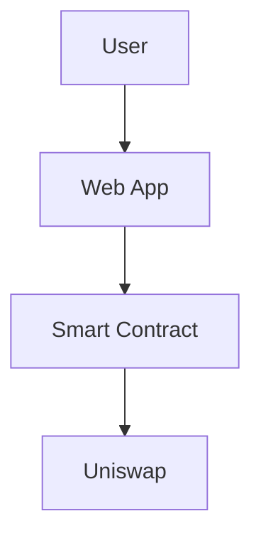

# 🚀 GitBook Publishing Guide for RAVO Documentation

<div align="center">


**Step-by-Step Guide to Publish Your RAVO Documentation on GitBook**

*Transform your documentation into a professional developer portal*

</div>

---

## 📋 Table of Contents

- [Prerequisites](#prerequisites)
- [GitBook Account Setup](#gitbook-account-setup)
- [Creating Your Space](#creating-your-space)
- [Importing Documentation](#importing-documentation)
- [Content Organization](#content-organization)
- [Customization & Branding](#customization--branding)
- [Publishing & Sharing](#publishing--sharing)
- [Advanced Features](#advanced-features)
- [Maintenance & Updates](#maintenance--updates)

---

## 🔧 Prerequisites

### **What You Need**

- ✅ **GitBook Account** ([gitbook.com](https://gitbook.com))
- ✅ **Documentation Files** (Your complete RAVO docs suite)
- ✅ **Web Browser** (Chrome, Firefox, Safari, or Edge)
- ✅ **Git Repository** (Optional, for version control)

### **Your Documentation Structure**
```
GITBOOK DOC/
├── README.md                    # Main entry point
├── DOCUMENTATION-SUMMARY.md     # Implementation summary
├── developer/
│   └── integration.md          # Developer guide
├── investor/
│   ├── getting-started.md      # User onboarding
│   └── economics.md            # Economics guide
├── technical/
│   ├── contracts.md            # Smart contracts
│   └── troubleshooting.md      # Troubleshooting
└── images/
    ├── diagrams/               # Architecture diagrams
    └── screenshots/            # Screenshots (when available)
```

---

## 🏗️ GitBook Account Setup

### **Step 1: Create GitBook Account**

1. **Visit GitBook**
   ```
   https://gitbook.com
   ```

2. **Sign Up Options**
   - **GitHub Account**: Recommended for developers
   - **Google Account**: Quick setup
   - **Email Registration**: Manual setup

3. **Choose Plan**
   - **Free Plan**: Perfect for getting started
     - Unlimited public spaces
     - Basic customization
     - Community support
   - **Team Plan**: For collaboration ($10/month)
   - **Enterprise**: For large organizations

### **Step 2: Verify Email**
- Check your email for verification link
- Click the link to activate your account
- Complete your profile setup

---

## 📚 Creating Your Space

### **Step 1: Create New Space**

1. **Dashboard Access**
   - Log into GitBook
   - Click **"Create"** button
   - Select **"Space"**

2. **Space Configuration**
   ```
   Space Name: RAVO Protocol Documentation
   Space URL: ravo-protocol (or custom)
   Visibility: Public (for open source)
   Description: Complete technical documentation for RAVO DeFi protocol
   ```

3. **Choose Template**
   - Select **"Blank"** template
   - We'll import your existing documentation

### **Step 2: Space Settings**

1. **General Settings**
   - **Title**: RAVO Protocol Documentation
   - **Description**: Comprehensive guide for developers and users
   - **Logo**: Upload your RAVO logo
   - **Cover Image**: Use your branding

2. **Domain Settings**
   - **Custom Domain**: docs.ravo.app (if available)
   - **GitBook Domain**: ravo-protocol.gitbook.io

---

## 📤 Importing Documentation

### **Method 1: Manual Upload (Recommended for Your Case)**

#### **Step 1: Create Page Structure**

1. **Root Pages** (Main navigation)
   ```
   📖 Getting Started (README.md)
   👥 For Investors (getting-started.md)
   💰 Token Economics (economics.md)
   🛠️ For Developers (integration.md)
   📋 Smart Contracts (contracts.md)
   🔧 Troubleshooting (troubleshooting.md)
   ```

2. **Create Folders**
   ```
   📁 Developer Documentation
   📁 Investor Guide
   📁 Technical Reference
   📁 Visual Assets
   ```

#### **Step 2: Upload Files**

1. **Navigate to Your Space**
   - Go to your GitBook space dashboard
   - Click **"New Page"** or **"+"** button

2. **Import Each File**
   - Click **"Import"** → **"Upload files"**
   - Select your Markdown files one by one
   - GitBook will preserve formatting and images

3. **Upload Images**
   - Create a page called **"Assets"** or **"Images"**
   - Upload your diagram files and screenshots
   - Reference them in your documentation using GitBook's image links

### **Method 2: Git Integration (Advanced)**

#### **Step 1: Connect Git Repository**

1. **Repository Setup**
   ```bash
   # Create a new repository for your docs
   git init ravo-documentation
   cd ravo-documentation

   # Copy your documentation files
   cp -r /path/to/GITBOOK\ DOC/* ./

   # Push to GitHub
   git add .
   git commit -m "Initial documentation commit"
   git remote add origin https://github.com/yourusername/ravo-documentation.git
   git push -u origin main
   ```

2. **GitBook Git Integration**
   - Go to your space settings
   - Click **"Git"** tab
   - Connect your GitHub repository
   - GitBook will automatically sync your changes

---

## 📁 Content Organization

### **Recommended Page Structure**

```
🏠 Home (README.md)
├── 👥 For Investors
│   ├── 🚀 Getting Started (investor/getting-started.md)
│   ├── 💰 Token Economics (investor/economics.md)
│   └── 📊 Portfolio Management
│
├── 🛠️ For Developers
│   ├── 🔧 Integration Guide (developer/integration.md)
│   ├── 📋 API Reference
│   └── 🧪 Testing & Deployment
│
├── 📚 Technical Documentation
│   ├── 📋 Smart Contracts (technical/contracts.md)
│   ├── 🔧 Troubleshooting (technical/troubleshooting.md)
│   └── 🏗️ Architecture Overview
│
├── 📊 Visual Assets
│   ├── 🏗️ System Diagrams (images/diagrams/)
│   └── 📸 Screenshots (images/screenshots/)
│
└── 🔗 Quick Links
    ├── 🌐 Live Platform
    ├── 💬 Community
    └── 🐛 GitHub Repository
```

### **Navigation Best Practices**

#### **1. Clear Hierarchy**
- Use 2-3 levels maximum
- Group related topics together
- Use descriptive page names

#### **2. Cross-References**
```markdown
<!-- Link to related sections -->
See also: [Smart Contracts](../technical/contracts.md)
Related: [Getting Started](../investor/getting-started.md)
```

#### **3. Table of Contents**
```markdown
<!-- Auto-generated TOC -->
[[toc]]
```

---

## 🎨 Customization & Branding

### **Step 1: Theme Customization**

1. **Access Theme Settings**
   - Go to Space Settings → **"Customization"**
   - Choose **"Theme"** tab

2. **Color Scheme**
   ```css
   /* Recommended RAVO colors */
   Primary: #4ecdc4 (Teal)
   Secondary: #ff6b6b (Coral)
   Accent: #9c88ff (Purple)
   Background: #000000 (Black)
   Text: #ffffff (White)
   ```

3. **Typography**
   - **Font Family**: Inter or similar modern font
   - **Heading Sizes**: H1 (32px), H2 (24px), H3 (20px)
   - **Body Text**: 16px with 1.6 line height

### **Step 2: Custom CSS (Advanced)**

```css
/* Custom CSS for RAVO branding */
:root {
  --color-primary: #4ecdc4;
  --color-secondary: #ff6b6b;
  --color-background: #000000;
  --color-text: #ffffff;
}

/* Custom button styles */
.gitbook-button {
  background: linear-gradient(45deg, #4ecdc4, #ff6b6b);
  border: none;
  border-radius: 8px;
  color: white;
  padding: 12px 24px;
  font-weight: 600;
}

/* Code block styling */
.gitbook-code {
  background: rgba(78, 205, 196, 0.1);
  border: 1px solid rgba(78, 205, 196, 0.3);
  border-radius: 6px;
}
```

### **Step 3: Logo and Branding**

1. **Upload Logo**
   - Go to Space Settings → **"Branding"**
   - Upload your RAVO logo (PNG/SVG, max 2MB)
   - Set logo size and positioning

2. **Favicon**
   - Upload a square version of your logo
   - Should be at least 32x32 pixels

3. **Cover Image**
   - Create an attractive hero image
   - Use your brand colors and messaging
   - Recommended size: 1200x400 pixels

---

## 🌐 Publishing & Sharing

### **Step 1: Publish Your Space**

1. **Ready to Publish**
   - Click **"Publish"** button in GitBook editor
   - Choose **"Publish to Web"**
   - Your documentation will be live instantly

2. **Custom Domain (Optional)**
   ```bash
   # If you have a custom domain
   docs.ravo.app → your-gitbook-space.gitbook.io
   ```

### **Step 2: Share Your Documentation**

#### **Social Media Sharing**
```markdown
🚀 RAVO Protocol Documentation is now live!

📚 Complete technical guide for developers
💰 Economics and token mechanics
🔧 Smart contract integration
📊 Real-time analytics

Read now: https://your-space.gitbook.io/ravo-protocol/

#RAVO #DeFi #Documentation #Web3
```

#### **Developer Community Sharing**
- **GitHub README**: Add documentation link
- **Telegram**: Share in community channels
- **Telegram**: Post in community groups
- **Twitter**: Announce to followers

#### **Integration Links**
```markdown
<!-- Add to your main website -->
<a href="https://your-space.gitbook.io/ravo-protocol/" target="_blank">
  📚 Developer Documentation
</a>

<!-- Add to GitHub repository -->
### 📖 Documentation
Complete technical documentation: [docs.ravo.app](https://your-space.gitbook.io/ravo-protocol/)
```

---

## ⚡ Advanced Features

### **Step 1: Interactive Elements**

#### **Code Playground**
```javascript
// Add interactive code examples
const ravoClient = new RAVOClient('your-api-key');

// Try it live!
console.log('Connected to RAVO');
```

#### **Live Diagrams**


#### **Embeddable Widgets**
```html
<!-- Embed trading chart -->
<iframe src="https://your-app.com/chart" width="100%" height="400"></iframe>
```

### **Step 2: SEO Optimization**

1. **Meta Tags**
   ```html
   <meta name="description" content="Complete technical documentation for RAVO DeFi protocol">
   <meta name="keywords" content="RAVO, DeFi, documentation, smart contracts, Web3">
   ```

2. **Structured Data**
   ```json
   {
     "@context": "https://schema.org",
     "@type": "TechArticle",
     "headline": "RAVO Protocol Documentation",
     "description": "Complete guide for RAVO DeFi platform",
     "author": "RAVO Team"
   }
   ```

### **Step 3: Analytics Integration**

1. **Google Analytics**
   ```javascript
   // Add to GitBook custom code
   gtag('config', 'GA_TRACKING_ID');
   ```

2. **Custom Tracking**
   ```javascript
   // Track documentation usage
   analytics.track('docs_viewed', {
     page: window.location.pathname,
     user_type: 'developer'
   });
   ```

---

## 🔄 Maintenance & Updates

### **Step 1: Version Control**

#### **Git Workflow**
```bash
# Regular update process
git checkout -b update-documentation
# Make changes to documentation files
git add .
git commit -m "Update: Add new API endpoints"
git push origin update-documentation

# Create pull request for review
# Merge to main branch
```

#### **GitBook Sync**
- GitBook automatically syncs with your repository
- Changes are reflected immediately
- Version history is maintained

### **Step 2: Content Updates**

#### **Regular Maintenance Tasks**
- ✅ **Weekly**: Check for broken links
- ✅ **Monthly**: Update contract addresses
- ✅ **Quarterly**: Review and update content
- ✅ **Bi-annually**: Major content refreshes

#### **Update Checklist**
```markdown
- [ ] Contract addresses current?
- [ ] Code examples functional?
- [ ] Links working?
- [ ] Images loading?
- [ ] Mobile responsive?
- [ ] SEO optimized?
```

### **Step 3: Community Feedback**

#### **Feedback Collection**
```markdown
<!-- Add feedback widget -->
<div class="feedback-widget">
  <h3>📝 Help us improve!</h3>
  <p>Found an error or have a suggestion?</p>
  <a href="https://github.com/ravo-dapp/ravo-documentation/issues" target="_blank">
    Report Issue
  </a>
</div>
```

#### **User Analytics**
- Track popular pages
- Identify confusing sections
- Monitor search queries
- A/B test content variations

---

## 📊 Success Metrics

### **Track Your Documentation Performance**

#### **Engagement Metrics**
- **Page Views**: Total visits to documentation
- **Unique Visitors**: New vs returning visitors
- **Time on Page**: Average time spent per page
- **Bounce Rate**: Percentage of single-page visits

#### **Content Metrics**
- **Search Queries**: What users are looking for
- **Popular Pages**: Most visited sections
- **Conversion Rate**: Developer sign-ups from docs
- **Feedback Score**: User satisfaction ratings

#### **Technical Metrics**
- **Load Time**: Page loading performance
- **Mobile Usage**: Percentage of mobile visitors
- **Error Rate**: 404 and other errors
- **SEO Ranking**: Search engine visibility

---

## 🎯 Quick Start Checklist

### **Get Your Documentation Live in 30 Minutes**

- [ ] **Create GitBook Account** (5 minutes)
- [ ] **Set Up New Space** (3 minutes)
- [ ] **Upload Main Files** (10 minutes)
  - README.md
  - developer/integration.md
  - investor/getting-started.md
- [ ] **Organize Navigation** (5 minutes)
- [ ] **Upload Images** (5 minutes)
- [ ] **Customize Branding** (2 minutes)
- [ ] **Publish & Share** (0 minutes - instant!)

---

## 🚨 Common Issues & Solutions

### **Upload Problems**
```bash
# If files won't upload
Solution: Check file size limits (GitBook allows up to 10MB per file)
Alternative: Split large files or use Git integration
```

### **Formatting Issues**
```markdown
# If Markdown formatting breaks
Solution: Use GitBook's preview mode to check rendering
Tip: Test code blocks and tables in preview before publishing
```

### **Image Problems**
```markdown
# If images don't load
Solution: Upload images to GitBook first, then reference them
Alternative: Use external image hosting (Imgur, GitHub, etc.)
```

### **SEO Issues**
```markdown
# If documentation doesn't rank well
Solution: Add meta descriptions and keywords
Tip: Use descriptive page titles and headings
```

---

## 🎉 You're All Set!

### **Congratulations!** 🎉

Your **RAVO Protocol documentation** is now live on GitBook with:

- ✅ **Professional appearance** and branding
- ✅ **Complete technical coverage** for developers
- ✅ **User-friendly guides** for investors
- ✅ **Interactive diagrams** and visual assets
- ✅ **Mobile-responsive design**
- ✅ **SEO optimization** for discoverability
- ✅ **Version control** and collaboration features

### **Share Your Success**

```markdown
🎉 RAVO Documentation is now live!

📚 Complete technical documentation for our DeFi protocol
🛠️ Developer integration guides
💰 Economics and token mechanics
📊 Real-time analytics integration

Check it out: https://your-space.gitbook.io/ravo-protocol/

#RAVO #DeFi #Documentation #Web3 #DeveloperTools
```

---

<div align="center">

**Need Help?** Contact our technical team or check our [troubleshooting guide](../technical/troubleshooting.md).

---

**Built with ❤️ by the RAVO Team**

*Professional documentation for the decentralized future*

</div>
