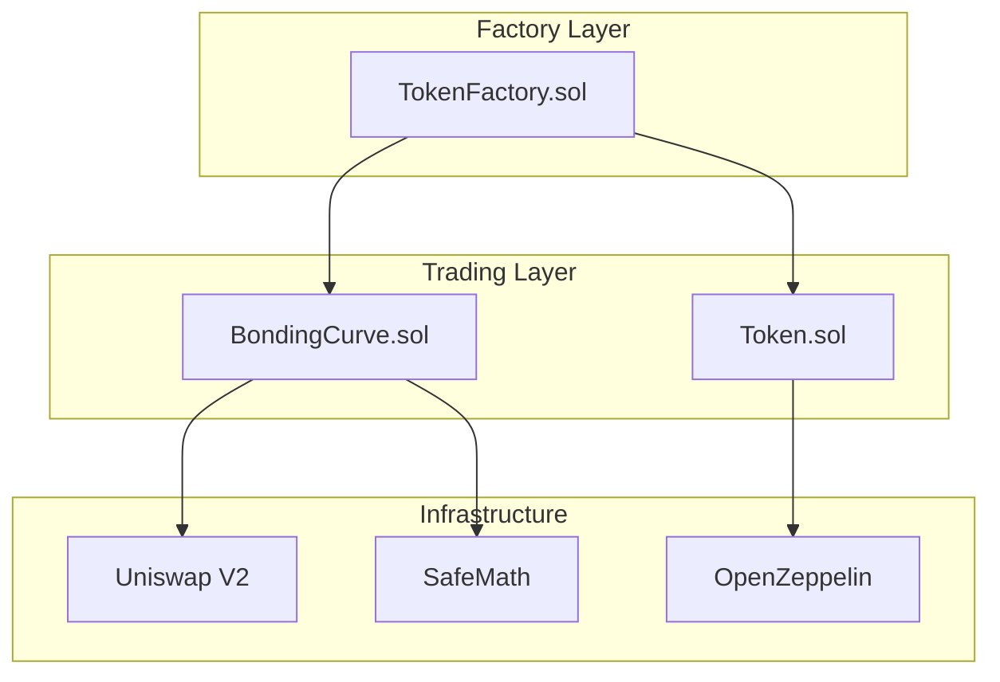
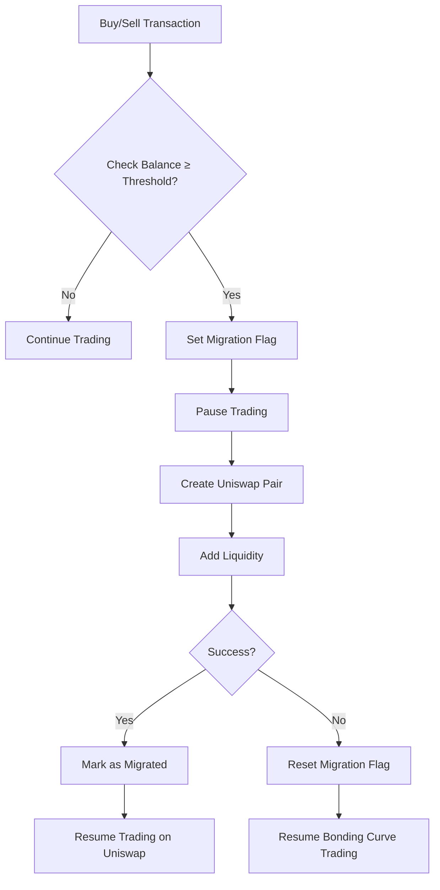

# 🔧 Smart Contract Documentation

<div align="center">


**Complete Technical Reference for RAVO Smart Contracts**

*Detailed contract interfaces, functions, and integration guides*

</div>

---

## 📋 Table of Contents

- [Contract Overview](#contract-overview)
- [Token Factory Contract](#token-factory-contract)
- [Bonding Curve Contract](#bonding-curve-contract)
- [ERC-20 Token Contract](#erc-20-token-contract)
- [Migration System](#migration-system)
- [Security Features](#security-features)
- [Gas Optimization](#gas-optimization)

---

## 🏗️ Contract Overview

### **Contract Architecture**

RAVO uses a modular smart contract architecture with the following components:



### **Deployment Strategy**

- **Token Factory**: Singleton contract deployed once
- **Bonding Curves**: Cloned for each token (gas efficient)
- **ERC-20 Tokens**: Cloned with minimal proxy pattern
- **Migration Contracts**: Deployed on-demand

### **Key Addresses**

#### **Sepolia Testnet**
```javascript
const CONTRACTS = {
  TOKEN_FACTORY: '0xa6b924e602eB9E8f6715439fd8C0111A3b4155C2',
  UNISWAP_ROUTER: '0xeE567Fe1712Faf6149d80dA1E6934E354124CfE3',
  UNISWAP_FACTORY: '0xF62c03E08ada871A0bEb309762E260a7a6a88075',
  WETH: '0x7b79995e5f793A07Bc00c21412e50Ecae098E7f9'
};
```

---

## 🏭 Token Factory Contract

### **Contract Interface**

```solidity
// SPDX-License-Identifier: MIT
pragma solidity ^0.8.30;

contract TokenFactory {
    // State variables
    address public immutable owner;
    address public immutable tokenLogic;
    address public immutable bondingCurveLogic;
    address public immutable walletA;
    address public immutable walletB;
    address public immutable walletDevelopment;

    uint256 public platformFee;
    uint256 public creationFee;
    uint256 public minMigrationThreshold;
    address public rfeeAddress;

    // Events
    event TokenCreated(
        address indexed token,
        address indexed bondingCurve,
        address indexed creator,
        uint256 launchTimestamp
    );

    event FeesUpdated(uint256 platformFee, uint256 creationFee);
    event MinMigrationThresholdUpdated(uint256 oldThreshold, uint256 newThreshold);
}
```

### **Core Functions**

#### **createToken()**

Creates a new token and bonding curve pair.

```javascript
function createToken(
    string memory name,
    string memory symbol,
    string memory telegram,
    string memory website,
    string memory xProfile,
    string memory description,
    uint256 migrationThreshold,
    uint256 initialBuyAmount,
    uint256 launchTimestamp
) external payable returns (address token, address bondingCurve)
```

**Parameters:**
- `name`: Token name (3-50 characters)
- `symbol`: Token symbol (1-10 characters)
- `telegram`: Telegram group link
- `website`: Project website URL
- `xProfile`: Twitter/X profile URL
- `description`: Project description (max 3000 characters)
- `migrationThreshold`: ETH amount to trigger Uniswap migration
- `initialBuyAmount`: Optional initial token purchase
- `launchTimestamp`: Scheduled launch time (0 for immediate)

**Requirements:**
- `migrationThreshold >= minMigrationThreshold`
- `msg.value >= creationFee + initialBuyAmount`
- `rfeeAddress != address(0)`

**Events Emitted:**
```solidity
emit TokenCreated(tokenAddress, bondingCurveAddress, msg.sender, launchTimestamp);
```

#### **setFees()**

Updates platform and creation fees (owner only).

```javascript
function setFees(uint256 _platformFee, uint256 _creationFee) external
```

**Parameters:**
- `_platformFee`: Platform fee in basis points (max 200 = 2%)
- `_creationFee`: Token creation fee in wei

**Requirements:**
- `msg.sender == owner`
- `_platformFee <= 200`
- `_creationFee <= 0.05 ether`

#### **setMinMigrationThreshold()**

Updates minimum migration threshold (owner only).

```javascript
function setMinMigrationThreshold(uint256 _minThreshold) external
```

**Parameters:**
- `_minThreshold`: Minimum migration threshold in wei

**Requirements:**
- `msg.sender == owner`
- `_minThreshold >= 0.00019 ether`

### **Fee Distribution**

#### **Automatic Fee Distribution**

```javascript
receive() external payable {
    // FEE DISTRIBUTION: 40% Wallet A, 40% Wallet B, 20% Development
    uint256 toWalletA = (msg.value * 40) / 100;
    uint256 toWalletB = (msg.value * 40) / 100;
    uint256 toDev = msg.value - toWalletA - toWalletB;

    walletABalance += toWalletA;
    walletBBalance += toWalletB;
    walletDevelopmentBalance += toDev;

    emit BalancesUpdated(walletABalance, walletBBalance, walletDevelopmentBalance);
}
```

#### **Manual Withdrawals**

```javascript
function withdrawWalletA() external
function withdrawWalletB() external
function withdrawDevelopment() external
```

**Requirements:**
- Only callable by respective wallet owners
- Must have balance > 0

---

## 📈 Bonding Curve Contract

### **Contract Interface**

```solidity
// SPDX-License-Identifier: MIT
pragma solidity ^0.8.30;

contract RavoBondingCurve {
    // State variables
    address public token;
    address public tokenFactory;
    address public rfeeAddress;

    uint256 public migrationThreshold;
    bool public migrated;
    uint256 public platformFee;

    uint256 public virtualEthReserve;
    uint256 public virtualTokenReserve;
    uint256 public k; // Constant product

    // Fee accumulation
    uint256 public accumulatedTokenFee;
    uint256 public accumulatedFactoryFee;
    uint256 public accumulatedRfeeFee;
}
```

### **Core Functions**

#### **initialize()**

Initializes the bonding curve with token parameters.

```javascript
function initialize(
    address _token,
    uint256 _migrationThreshold,
    uint256 _platformFee,
    address _tokenFactory,
    address _rfeeAddress
) external
```

**Parameters:**
- `_token`: ERC-20 token contract address
- `_migrationThreshold`: ETH amount to trigger migration
- `_platformFee`: Platform fee in basis points
- `_tokenFactory`: Factory contract address
- `_rfeeAddress`: Fee recipient address

**Initialization Logic:**
```javascript
// Set virtual reserves: r_x0_eth = (6 * migrationThreshold) / 17
uint256 r_x0_eth = (6 * _migrationThreshold) / 17;
virtualEthReserve = r_x0_eth;

// Calculate virtual token reserve
uint256 numerator = TOTAL_SUPPLY_FOR_SALE * (r_x0_eth + _migrationThreshold);
virtualTokenReserve = numerator / _migrationThreshold;

// Calculate k constant
(k, success) = SafeMath.tryMul(virtualEthReserve, virtualTokenReserve);
require(success, "Overflow in k calculation");
```

#### **buyTokens()**

Executes a token purchase with slippage protection.

```javascript
function buyTokens(uint256 slippagePercent) external payable returns (uint256)
```

**Parameters:**
- `slippagePercent`: Maximum acceptable slippage (0-100%)

**Process:**
1. **Validate Inputs**: Check ETH sent and slippage parameters
2. **Calculate Fees**: Deduct platform fee from sent amount
3. **Estimate Tokens**: Calculate expected token output
4. **Slippage Check**: Ensure output meets minimum requirements
5. **Update Reserves**: Adjust virtual reserves using curve formula
6. **Transfer Tokens**: Mint and transfer tokens to buyer
7. **Migration Check**: Trigger migration if threshold reached

**Mathematical Formula:**
```javascript
// Buy calculation
uint256 feeAmount = (msg.value * platformFee) / 10000;
uint256 netEth = msg.value - feeAmount;

// Update virtual reserves
uint256 newVirtualEthReserve = virtualEthReserve + netEth;
uint256 newVirtualTokenReserve = k / newVirtualEthReserve;

// Calculate tokens bought
uint256 tokensBought = virtualTokenReserve - newVirtualTokenReserve;
```

#### **sellTokens()**

Executes a token sale with slippage protection.

```javascript
function sellTokens(uint256 tokenAmount, uint256 slippagePercent) external
```

**Parameters:**
- `tokenAmount`: Amount of tokens to sell
- `slippagePercent`: Maximum acceptable slippage (0-100%)

**Process:**
1. **Validate Balance**: Check user token balance and allowance
2. **Transfer Tokens**: Move tokens from user to contract
3. **Calculate ETH**: Use curve formula to determine ETH output
4. **Apply Fees**: Deduct platform fee from gross amount
5. **Slippage Check**: Ensure output meets minimum requirements
6. **Transfer ETH**: Send net ETH to seller
7. **Update Reserves**: Adjust virtual reserves

**Mathematical Formula:**
```javascript
// Sell calculation
uint256 newVirtualTokenReserve = virtualTokenReserve + tokenAmount;
uint256 newVirtualEthReserve = k / newVirtualTokenReserve;

// Calculate ETH received
uint256 grossEth = virtualEthReserve - newVirtualEthReserve;
uint256 feeAmount = (grossEth * platformFee) / 10000;
uint256 netEth = grossEth - feeAmount;
```

### **Estimation Functions**

#### **estimateBuyTokens()**

Estimates token output for a given ETH input.

```javascript
function estimateBuyTokens(uint256 ethAmount) public view returns (uint256)
```

**Returns:** Expected number of tokens for the given ETH amount

#### **estimateSellETH()**

Estimates ETH output for a given token input.

```javascript
function estimateSellETH(uint256 tokenAmount) public view returns (uint256)
```

**Returns:** Expected ETH amount for the given token quantity

#### **getTokenPrice()**

Returns the current token price in ETH.

```javascript
function getTokenPrice() public view returns (uint256)
```

**Returns:** Current price in wei (18 decimals)

**Formula:**
```javascript
return (virtualEthReserve * 1e18) / virtualTokenReserve;
```

### **Migration System**

#### **Migration Process**

```javascript
function _migrateToUniswap() internal {
    require(!migrated, "Already migrated");
    require(!isMigrating, "Migration in progress");

    isMigrating = true;

    uint256 tokenAmountForLiquidity = IToken(token).balanceOf(address(this));
    uint256 ethAmountForLiquidity = address(this).balance;

    require(ethAmountForLiquidity > 0, "Zero ETH for liquidity");
    require(tokenAmountForLiquidity > 0, "Zero tokens for liquidity");

    // Attempt migration
    try this._attemptMigration(tokenAmountForLiquidity, ethAmountForLiquidity) {
        migrated = true;
        isMigrating = false;
        _distributeAccumulatedFees();
    } catch {
        isMigrating = false;
        // Migration failed - trading re-enabled
    }
}
```

#### **Migration Execution**

```javascript
function _attemptMigration(uint256 tokenAmount, uint256 ethAmount) external {
    require(msg.sender == address(this), "Only self-call allowed");

    IUniswapV2Router02 router = IUniswapV2Router02(UNISWAP_ROUTER);
    address pair = IUniswapV2Factory(router.factory()).createPair(token, router.WETH());

    // Add liquidity with 1% slippage tolerance
    router.addLiquidityETH{value: ethAmount}(
        token,
        tokenAmount,
        (tokenAmount * 99) / 100,  // min tokens
        (ethAmount * 99) / 100,    // min ETH
        BURN_ADDRESS,              // LP tokens to burn
        block.timestamp
    );

    emit MigratedToUniswap(pair, ethAmount, tokenAmount);
}
```

### **Fee Distribution System**

#### **Accumulated Fee Distribution**

```javascript
function _distributeAccumulatedFees() internal {
    uint256 tokenFeeToDistribute = accumulatedTokenFee;
    uint256 factoryFeeToDistribute = accumulatedFactoryFee;
    uint256 rfeeFeeToDistribute = accumulatedRfeeFee;

    // Distribute to Token (50% of platform fees)
    if (tokenFeeToDistribute > 0) {
        (bool sentToToken,) = token.call{value: tokenFeeToDistribute}("");
        if (sentToToken) {
            accumulatedTokenFee = 0;
        }
    }

    // Distribute to Factory (25% of platform fees)
    if (factoryFeeToDistribute > 0) {
        (bool sentToFactory,) = tokenFactory.call{value: factoryFeeToDistribute}("");
        if (sentToFactory) {
            accumulatedFactoryFee = 0;
        }
    }

    // Distribute to Rfee (25% of platform fees)
    if (rfeeFeeToDistribute > 0 && rfeeAddress != address(0)) {
        (bool sentToRfee,) = rfeeAddress.call{value: rfeeFeeToDistribute}("");
        if (sentToRfee) {
            accumulatedRfeeFee = 0;
        }
    }

    lastFeeDistribution = block.timestamp;
}
```

---

## 🪙 ERC-20 Token Contract

### **Contract Interface**

```solidity
// SPDX-License-Identifier: MIT
pragma solidity ^0.8.30;

contract Token is IERC20 {
    // ERC-20 Standard
    string public name;
    string public symbol;
    uint8 public constant decimals = 18;
    uint256 public totalSupply;
    mapping(address => uint256) public balanceOf;
    mapping(address => mapping(address => uint256)) public allowance;

    // RAVO Extensions
    string public description;
    address public bondingCurveAddress;
    address public factory;

    string public telegram;
    string public website;
    string public xProfile;

    uint256 public launchTime;
    bool public tradingOpen;
    uint256 public ethBalance;
}
```

### **Standard ERC-20 Functions**

#### **transfer()**

```javascript
function transfer(address to, uint256 amount) public returns (bool)
```

**Standard ERC-20 transfer with burn capability:**
```javascript
function _transfer(address from, address to, uint256 amount) internal {
    require(balanceOf[from] >= amount, "Balance too low");

    unchecked {
        balanceOf[from] -= amount;
        if (to != address(0)) {
            balanceOf[to] += amount;
        } else {
            totalSupply -= amount; // Burning reduces supply
        }
    }

    emit Transfer(from, to, amount);
}
```

#### **approve()**

```javascript
function approve(address spender, uint256 amount) public returns (bool)
```

#### **transferFrom()**

```javascript
function transferFrom(address from, address to, uint256 amount) public returns (bool)
```

### **RAVO-Specific Functions**

#### **approveBondingCurve()**

Convenience function to approve maximum tokens for trading.

```javascript
function approveBondingCurve() external
```

**Automatically approves 800 million tokens:**
```javascript
uint256 maxApproval = 800_000_000 * 10**18;
allowance[msg.sender][bondingCurveAddress] = maxApproval;
```

#### **setDescription()**

Updates token description (owner only).

```javascript
function setDescription(string memory _description) external onlyOwner
```

#### **setSocialLinks()**

Updates social media links (owner only).

```javascript
function setSocialLinks(
    string memory _telegram,
    string memory _website,
    string memory _xProfile
) external onlyOwner
```

#### **openTradingNow()**

Forces immediate trading activation (owner only).

```javascript
function openTradingNow() external onlyOwner
```

**Requirements:**
- `!tradingOpen` (trading not already open)
- `msg.sender == owner`

#### **withdrawETH()**

Withdraws accumulated ETH (owner only).

```javascript
function withdrawETH(address payable recipient, uint256 amount) external onlyOwner
```

**Requirements:**
- `recipient != address(0)`
- `amount <= ethBalance`

### **Trading Control**

#### **isTradingOpen()**

Returns whether trading is currently allowed.

```javascript
function isTradingOpen() public view returns (bool)
```

**Logic:**
```javascript
return tradingOpen || block.timestamp >= launchTime;
```

### **Initialization**

#### **initialize()**

Sets up the token with all parameters.

```javascript
function initialize(
    string memory _name,
    string memory _symbol,
    address _initialHolder,
    address _owner,
    string memory _telegram,
    string memory _website,
    string memory _xProfile,
    string memory _description,
    uint256 _launchTimestamp,
    address _factory
) public
```

**Key Setup:**
```javascript
name = _name;
symbol = _symbol;
totalSupply = 1_000_000_000 * 10**18; // 1 billion tokens
balanceOf[_initialHolder] = totalSupply; // All tokens to bonding curve
bondingCurveAddress = _initialHolder; // Bonding curve holds initial supply

if (_launchTimestamp == 0) {
    tradingOpen = true;
} else {
    launchTime = _launchTimestamp;
    tradingOpen = false;
}
```

---

## 🔄 Migration System

### **Migration States**

```javascript
enum MigrationState {
    NOT_MIGRATED,      // Trading on bonding curve
    MIGRATING,         // Migration in progress
    MIGRATED,          // Successfully migrated to Uniswap
    MIGRATION_FAILED   // Migration failed, can retry
}
```

### **Migration Triggers**

#### **Automatic Migration**
```javascript
function buyTokensFor(address recipient) external payable returns (uint256) {
    // ... buy logic ...

    // Check for migration
    if (address(this).balance >= migrationThreshold) {
        _migrateToUniswap();
    }

    return tokensBought;
}
```

#### **Manual Migration Retry**
```javascript
function retryMigration() external
```

**Requirements:**
- `!migrated` - Not already migrated
- `!isMigrating` - Not currently migrating
- `address(this).balance >= migrationThreshold` - Threshold reached

### **Migration Process Flow**



---

## 🔒 Security Features

### **Access Control**

#### **Function Modifiers**
```solidity
modifier whenTradingOpen() {
    require(IToken(token).isTradingOpen(), "Trading not open");
    _;
}

modifier whenNotMigrating() {
    require(!isMigrating, "Migration in progress - trading disabled");
    _;
}

modifier onlyTokenFactory() {
    require(msg.sender == tokenFactory, "Only token factory can call this function");
    _;
}
```

### **Input Validation**

#### **Amount Validation**
```javascript
require(msg.value > 0, "No ETH sent");
require(tokenAmount > 0, "No tokens sent");
require(slippagePercent >= 0 && slippagePercent <= 100, "Slippage must be 0-100%");
```

#### **Address Validation**
```javascript
require(recipient != address(0), "Invalid recipient");
require(spender != address(0), "Invalid spender");
```

### **Overflow Protection**

#### **SafeMath Usage**
```javascript
// Using OpenZeppelin SafeMath for all calculations
uint256 newVirtualEthReserve = SafeMath.add(virtualEthReserve, netEth);
uint256 newVirtualTokenReserve = SafeMath.div(k, newVirtualEthReserve);
uint256 tokensBought = SafeMath.sub(virtualTokenReserve, newVirtualTokenReserve);
```

#### **Explicit Overflow Checks**
```javascript
(bool success, uint256 kValue) = SafeMath.tryMul(virtualEthReserve, virtualTokenReserve);
require(success, "Overflow in k calculation");
```

### **Reentrancy Protection**

#### **NonReentrant Modifier**
```javascript
function buyTokens(uint256 slippagePercent) external payable nonReentrant returns (uint256)
function sellTokens(uint256 tokenAmount, uint256 slippagePercent) public nonReentrant
```

### **Emergency Controls**

#### **Circuit Breakers**
- Migration pause mechanism
- Trading activation controls
- Emergency withdrawal functions

#### **Admin Controls**
- Fee parameter updates
- Threshold adjustments
- Owner transfer capabilities

---

## ⚡ Gas Optimization

### **Proxy Patterns**

#### **Minimal Proxy (EIP-1167)**
```javascript
// Using clones for gas-efficient deployment
address tokenClone = Clones.clone(tokenLogic);
address bondingCurveClone = Clones.clone(bondingCurveLogic);
```

**Gas Savings:**
- **Regular Deployment**: ~500,000 gas per contract
- **Clone Deployment**: ~50,000 gas per contract
- **Savings**: 90% reduction in deployment costs

### **Storage Optimization**

#### **Packing Variables**
```solidity
// Pack smaller variables together
uint256 public migrationThreshold;  // slot 1
bool public migrated;               // slot 1 (packed)
uint256 public platformFee;         // slot 2
bool private isMigrating;           // slot 2 (packed)
```

#### **Efficient Mappings**
```javascript
// Use uint256 for balance tracking
mapping(address => uint256) public balanceOf;
mapping(address => mapping(address => uint256)) public allowance;
```

### **Computational Optimization**

#### **Batch Operations**
```javascript
// Single update for multiple state changes
totalTokensSold = SafeMath.add(totalTokensSold, tokensBought);
virtualEthReserve = newVirtualEthReserve;
virtualTokenReserve = newVirtualTokenReserve;
```

#### **Cached Calculations**
```javascript
// Cache frequently used values
uint256 currentBalance = address(this).balance;
uint256 availableTokens = IToken(token).balanceOf(address(this));
```

### **External Call Optimization**

#### **Interface Calls**
```javascript
// Use specific interface functions
IToken(token).transfer(recipient, tokensBought);
IToken(token).balanceOf(address(this));
```

#### **Low-Level Calls for ETH Transfers**
```javascript
// Use low-level calls for ETH transfers
(bool success,) = payable(recipient).call{value: amount}("");
require(success, "ETH transfer failed");
```

---

## 📊 Monitoring & Analytics

### **Event Logging**

#### **Trading Events**
```javascript
event TokensBought(
    address indexed buyer,
    uint256 tokenAmount,
    uint256 ethAmount,
    uint256 fee
);

event TokensSold(
    address indexed seller,
    uint256 tokenAmount,
    uint256 ethAmount,
    uint256 fee
);
```

#### **Migration Events**
```javascript
event MigratedToUniswap(
    address indexed pair,
    uint256 ethAmount,
    uint256 tokenAmount
);

event MigrationStatusChanged(bool migrated, bool isMigrating);
```

#### **Configuration Events**
```javascript
event MigrationThresholdUpdated(uint256 oldThreshold, uint256 newThreshold);
event PlatformFeeUpdated(uint256 oldFee, uint256 newFee);
```

### **View Functions**

#### **Market Metrics**
```javascript
function getTokenPrice() public view returns (uint256)
function getMarketCapInETH() public view returns (uint256)
function getProgress() public view returns (uint256)
function getMigrationStatus() public view returns (bool, bool, bool)
```

#### **Reserve Information**
```javascript
function getReserves() public view returns (
    uint256 virtualEthReserve,
    uint256 virtualTokenReserve,
    uint256 k
)
```

---

## 🔧 Integration Examples

### **Complete Trading Flow**

```javascript
// 1. Setup contracts
const factory = new ethers.Contract(FACTORY_ADDRESS, FACTORY_ABI, signer);
const provider = new ethers.providers.Web3Provider(window.ethereum);

// 2. Create token
const tx = await factory.createToken(
  "My Token", "MTK", "", "https://mytoken.com", "",
  "My awesome project", parseEther("0.01"), parseEther("0.1"), 0,
  { value: parseEther("0.1001") }
);

// 3. Get deployed addresses
const receipt = await tx.wait();
const tokenAddress = getTokenAddressFromLogs(receipt);
const bondingCurveAddress = getBondingCurveAddressFromLogs(receipt);

// 4. Setup trading contracts
const token = new ethers.Contract(tokenAddress, TOKEN_ABI, signer);
const bondingCurve = new ethers.Contract(bondingCurveAddress, BONDING_CURVE_ABI, signer);

// 5. Approve tokens for trading
await token.approveBondingCurve();

// 6. Estimate and execute trades
const estimatedTokens = await bondingCurve.estimateBuyTokens(parseEther("0.01"));
console.log(`Expected tokens: ${formatEther(estimatedTokens)}`);

const buyTx = await bondingCurve.buyTokens(2, { value: parseEther("0.01") });
await buyTx.wait();

// 7. Monitor migration
const [migrated, isMigrating, canRetry] = await bondingCurve.getMigrationStatus();
if (canRetry) {
  await bondingCurve.retryMigration();
}
```

---

<div align="center">

## 📚 Additional Resources

**📖 [API Reference](./api.md)** • **🔐 [Security Guide](./security.md)** • **🧪 [Testing Guide](./testing.md)**

**🆘 Need Help?** Contact our technical support team.

---

**Built with ❤️ by the RAVO Team**

*Secure, efficient, and mathematically sound DeFi infrastructure*

</div>
